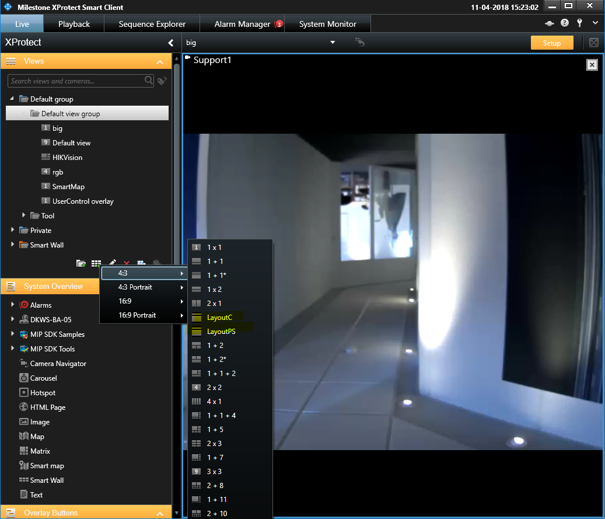
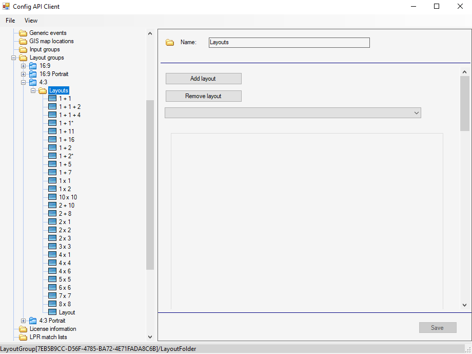

# Adding view layout using Configuration API

A view layout is the template for creating views in the Smart Client.
The layout controls how many items can be displayed, how the items are
sized, and how they share the space in the view.

The two samples, AddLayout and AddLayout_PS, demonstrates how to do that
using C\# and PowerShell scripts respectively.

*Screen capture showing a Smart Client setup, creating new view dialogs.*

## How to use the samples (AddLayout and AddLayout_PS)

1. Build and run the IconToString tool that can be found in the
    `AddLayout_PS` folder. When running it, you must supply two
    parameters:
    - `"C:\Program Files\Milestone\MIPSDK\ComponentSamples\AddLayout_PS\icon.png"`
    - `"C:\Program Files\Milestone\MIPSDK\ComponentSamples\AddLayout_PS\Layout.xml"`
2. Copy these files:
    - `Autofac.dll`
    - `Microsoft.IdentityModel.JsonWebTokens.dll`
    - `Microsoft.IdentityModel.Logging.dll`
    - `Microsoft.IdentityModel.Protocols.dll`
    - `Microsoft.IdentityModel.Protocols.OpenIdConnect.dll`
    - `Microsoft.IdentityModel.Tokens.dll`
    - `Newtonsoft.Json.dll`
    - `System.IdentityModel.Tokens.Jwt.dll`
    - `System.Net.Http.Formatting.dll`
    - `VideoOS.IdentityServer.Common.dll`
    - `VideoOS.Platform.Common.dll`
    - `VideoOS.Platform.dll`
    - `VideoOS.Platform.SDK.dll`

    from `C:\Program Files\Milestone\MIPSDK\Bin` to
    `C:\Program Files\Milestone\MIPSDK\ComponentSamples\AddLayout_PS\`
3. Prepare an assembly binding redirect for Windows PowerShell.

    Both version 6 and version 12 of `Newtonsoft.Json.dll` will be referenced when
    `AddLayout.ps1` is run by Windows PowerShell. To avoid assembly binding conflicts,
    we must create an assembly binding redirect. Do this by adding a config file next
    to `powershell.exe` or `powershell_ise.exe`, named respectively `powershell.exe.config`
    and `powershell_ise.exe.config`. The config file should contain the following lines:

    ~~~ xml
    <runtime>
        <assemblyBinding xmlns="urn:schemas-microsoft-com:asm.v1">
            <dependentAssembly>
                <assemblyIdentity name="Newtonsoft.Json" publicKeyToken="30AD4FE6B2A6AEED" culture="neutral"/>
                <bindingRedirect oldVersion="0.0.0.0-12.0.0.0" newVersion="12.0.0.0"/>
            </dependentAssembly>
        </assemblyBinding>
    </runtime>
    ~~~

    The directory where the `powershell.exe` or `powershell_ise.exe` file is located
    might be write protected, and you might want to avoid changing assembly binding
    for PowerShell globally. Just copy the PowerShell exe file to a directory where
    you have write access, add the config file here, and run PowerShell from here.
4. Run the PowerShell script
    `C:\Program Files\Milestone\MIPSDK\ComponentSamples\AddLayout_PS\AddLayout.ps1`
5. In XProtect Smart Client, go into setup mode and see that you have a
    new layout named LayoutPS.
6. Copy the newly created file
    (`C:\Program Files\Milestone\MIPSDK\ComponentSamples\AddLayout_PS\LayoutNEW.xml`)
    to the folder of the C\# sample
    (`C:\Program Files\Milestone\MIPSDK\ComponentSamples\AddLayout\`)
7. Build and run the AddLayout C\# sample.
8. In XProtect Smart Client, go into setup mode and see that you have a
    new layout named LayoutC.

### Layout definition XML file

The layout is defined by specifying the layout in XML format. The
definition XML file (before adding an icon) looks like this:

~~~ xml
<ViewLayout>
  <ViewItems>
    <ViewItem>
      <Position><X>0</X><Y>0</Y></Position>
      <Size><Width>1000</Width><Height>200</Height></Size>
    </ViewItem>
    <ViewItem>
      <Position><X>0</X><Y>200</Y></Position>
      <Size><Width>1000</Width><Height>800</Height></Size>
    </ViewItem>
  </ViewItems>
</ViewLayout>
~~~

The layout can be modified by changing this XML file.

### Adding an icon

The layout can be improved by adding an icon. The icon graphics must be
converted to Base64String and then inserted into the XML. The
IconToString tool sample does this. The IconToString tool sample takes
two parameters:

- The path and name of an icon graphics file
- The path and name of the layout definition XML file

The tool will output a new XML file. The name of this new file will be
the name of the input XML file extended with \"NEW\". For example, the
input file Layout.xml results in a new file named LayoutNEW.xml.

### Samples

Both samples can work with modified input files rather than those
supplied, but because the samples have all parameters hard-coded, they
will not be practical. A tool should be developed based on either of the
two samples, but with added functionality. It should also be considered
that if you make a tool to add layouts, you will probably need to have a
tool that can remove layouts. It has not been the intention to develop a
tool, but to make a sample that can be used as inspiration and as a
starting point.

For initial testing you will be able to use the Config API Client sample
to remove layouts.

*Screen capture showing the Config API Client showing the layouts added
by the samples.*

## The sample demonstrates

- Login default Windows credentials
- Usage of strongly typed Configuration API classes to add a
    view-layout to the VMS

## Using

- VideoOS.Platform.ConfigurationItems
- VideoOS.Platform.ConfigurationItems.ManagementServer
- VideoOS.Platform.ConfigurationItems.LayoutFolder.AddLayout

## Environments

- .NET library MIP Environment
- PowerShell

## Visual Studio C\# project

- [AddLayout.csproj](javascript:openLink('..\\\\ComponentSamples\\\\AddLayout\\\\AddLayout.csproj');)
- [IconToString.csproj](javascript:openLink('..\\\\ComponentSamples\\\\AddLayout\\\\AddLayout_PS\\\\IconToString\\\\IconToString.csproj');)
