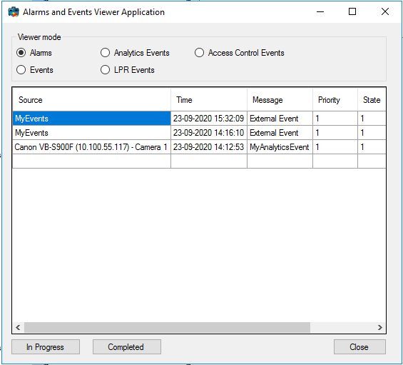

# Alarm and Event Viewer

This sample shows how to present alarms or events in a dynamic list.
Dynamic means that new and updated alarms/events will automatically show
up in the list. You can choose alarm and four types of events: General
events, Analytics events, Access Control Events or LPR events.

This sample also shows how to update the state of alarms to \"In
Progress\" or \"Completed\".

## The sample demonstrates

- How to retrieve alarm or event lines using a filter.
- How to listen for new and changed alarms and how to listen for new events.
- How to update alarm data.

## Using

- VideoOS.Platform.Data.Alarm
- VideoOS.Platform.Proxy.Alarm.AlarmLine
- VideoOS.Platform.Proxy.Alarm.EventLine
- VideoOS.Platform.Proxy.AlarmClient.AlarmClientManager
- VideoOS.Platform.Proxy.AlarmClient.IAlarmClient
- VideoOS.Platform.Messaging.Message
- VideoOS.Platform.Messaging.MessageCommunicationManager
- VideoOS.Platform.Messaging.CommunicationIdFilter
- VideoOS.Platform.Messaging.ChangedAlarmData
- VideoOS.Platform.Messaging.MessageId.Server.NewAlarmIndication
- VideoOS.Platform.Messaging.MessageId.Server.ChangedAlarmIndication
- VideoOS.Platform.Messaging.MessageId.Server.NewEventsIndication
- VideoOS.Platform.MessageReceiver

## Environment

- MIP .NET library

## Visual Studio C\# project

- [AlarmEventViewer.csproj](javascript:clone('https://github.com/milestonesys/mipsdk-samples-component','src/ComponentSamples.sln');)
