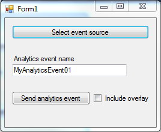

# Analytics Event Trigger via library

This sample demonstrates how to submit an Analytics Event to the
Milestone XProtect Event Server using the .NET library.

Analytics events can be used to trigger alarms.

Both the analytics event and the alarm can be seen in the Smart Client,
or by 3rd-party applications.

Alarm Definitions can be configured to create alarms based on Analytics
events and the alarms can be seen in the Smart Client.

## How to configure and run the sample

- Set up an analytics event named MyAnalyticsEvent01 in your XProtect
  Management Client
- Setup an alarm that is created based on the analytics event (the
  name configured above)

- Start the sample, login to the XProtect Server, select a camera from
  the system as event source, and hit the \"Send analytics event\" button.
  - Note: The Analytics event name must match a name you have configured
    in the Management Client
- Use the Smart Client Alarm Manager tab to see the Alarm in the Alarm
  List.

- Switch the Smart Client alarm list to show events and see the event.
  (You can omit step 2 and 4 if you would like to use analytics event
  without using alarms.)

## The sample demonstrates

- How to submit an analytics event via .NET Library to the Event Server

## Using

- VideoOS.Platform.Data.AnalyticsEvent
- VideoOS.Platform.Data.AnalyticsObject
- VideoOS.Platform.Messaging.Message

## Environment

- .NET Library

## Visual Studio C\# project

- [AnalyticsEventTriggerViaLibrary.csproj](javascript:clone('https://github.com/milestonesys/mipsdk-samples-component','src/ComponentSamples.sln');)
