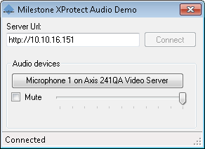

# Audio Demo

The AudioDemo sample shows how a microphone can be selected and the use
of the AudioPlayerControl. The login credentials used in this sample is
a current Windows credentials.

When a microphone has been selected the incoming audio from that
microphone is played on the PC\'s speakers.

## The sample demonstrates

-   Initialization of MIP .Net Library, when audio playback is required
-   How to use the ItemPickerForm to select a microphone

## Using

-   VideoOS.Platform.ClientControl
-   VideoOS.Platform.UI.ItemPickerForm
-   VideoOS.Platform.UI.AudioPlayerControl

## Environment

-   MIP .NET library

## Visual Studio C\# project

-   [AudioDemo.csproj](javascript:openLink('..\\\\ComponentSamples\\\\AudioDemo\\\\AudioDemo.csproj');)

## Special notes

This sample needs access to configuration and use of AudioPlayerControl
for audio playing.

Please use the CopyUIFiles.bat file for copying the correct files from
the MIPSDK folder to your folder, e.g. have this in the post-build
event:

~~~ cmd
cd "$(ProjectDir)..\..\bin"
call CopyUIFiles.bat "$(TargetDir)"
~~~

The reason for using this bat file is to allow for updating to new
MIPSDK versions and get any new or changed files included.
