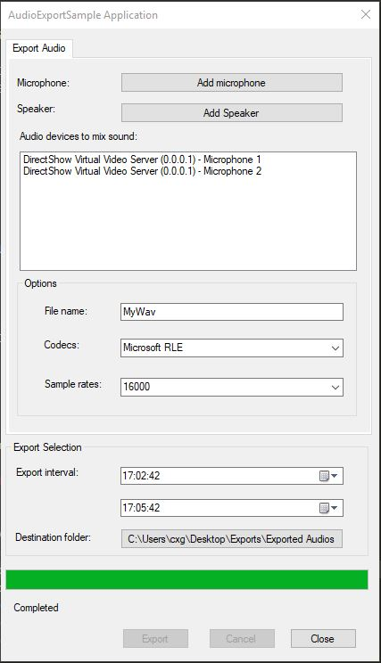

# Audio export sample

This sample can be used to export mixed audio stream into a WAV file in
Standalone application.

You can select one or multiple audio devices. For mixed sound, you can
either combine audio streams from microphone and speaker devices, or
combine audio streams only from microphone or combine audio streams from
only speaker devices. To use the sample, you have to provide a file
name, select codec, sample rates, export period. The sample only support
one export at a time.

## The sample demonstrates

- How to perform WAV export in Standalone application

## Using

- VideoOS.Platform.Data.WAVExporter class

## Environment

- MIP .NET library

## Visual Studio C\# project

- [AudioExportSample.csproj](javascript:clone('https://github.com/milestonesys/mipsdk-samples-component','src/ComponentSamples.sln');)
