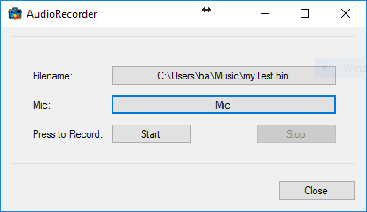

# Audio Live Recorder

The AudioRecorder tool can record an audio stream from a microphone on
the VMS into raw data binary file. This file can later be used to play
the audio on a PC sound card.

The stored format is always sampling 8000 times per second, in mono, and
with a bit width of 16 bits per sample.

## The sample demonstrates

- How to create a file with raw audio (PCM) data from live audio
  source (within the VMS)

## Using

- VideoOS.Platform.Live.PcmLiveSource

## Environment

- None

## Visual Studio C\# project

- [AudioLiveRecorder.csproj](javascript:clone('https://github.com/milestonesys/mipsdk-samples-component','src/ComponentSamples.sln');)
