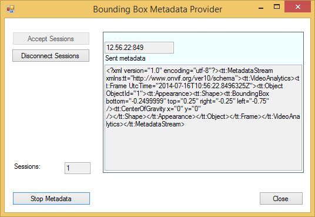
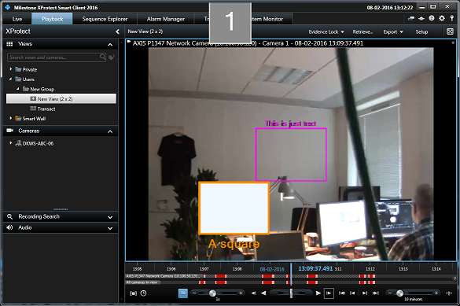

# Bounding Box Metadata Provider

This sample shows how bounding box metadata can be injected into an
XProtect system.

The sample uses the C\# .Net MIP SDK Library for all communication and
synchronization, while the sample focus on providing metadata. The
sample supports multiple simultaneous connections, e.g. metadata can be
distributed to two XProtect Recording servers. Furthermore, this sample
demonstrates the push-functionality of metadata, which is in contrast
with the video provider, where data is polled. Thus it is possible to
send metadata at will and even have long pauses in the data.

The sample also demonstrates how to use the Milestone extensions for
bounding boxes. The sample will create two bounding boxes, where one
will change color, line thickness, fill and description. The description
will also change layout and placement.

The MIP Driver with metadata support is part of the normal Device Packs
from version 7.3.

## How to use this sample

-   Start the sample
-   Click the \"Accept Sessions\" button
-   Start the Management Client
-   Start the add hardware wizard
-   Choose Manual
-   Add username and password to the search list: \"root\", \"password\"
-   Select to use the \"MIP Driver\" under \"Milestone\"
-   Enter IP address of the machine this sample is running on, and port
    52123
-   Create a link between a camera and the new metadata device by
    selecting the camera, then choose the \"Client\" tab and finally add
    the metadata device to the \"Related metadata:\" list.
-   Start the Smart Client and choose the camera. Make sure to check in
    setup mode that bounding boxes are enabled and that the new metadata
    device is in the \"Bounding Box Providers\" list.
-   Press the \"Start Metadata\" button on the sample application after
    a connection has been established.
-   A bounding box will now begin to move clockwise in a rectangular
    pattern across the screen, while changing color, fill and
    description. There is also a static bounding box that does not
    change layout.
-   Press \"Stop Metadata\" to stop the stream or Close to exit the
    sample application.

## The sample demonstrates

-   How metadata can be stored in XProtect
-   How to support multiple server channels simultaneously

## Using

-   VideoOS.Platform.Data.MediaVideoService
-   VideoOS.Platform.Data.MetadataVideoChannel
-   VideoOS.Platform.Data.HardwareDefinition
-   VideoOS.Platform.Data.MetadataStream

## Environment

-   MIP .NET library

## Visual Studio C\# project

-   [BoundingBoxMetadataProvider.csproj](javascript:openLink('..\\\\ComponentSamples\\\\BoundingBoxMetadataProvider\\\\BoundingBoxMetadataProvider.csproj');)
