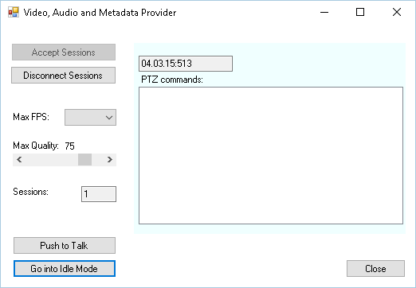

# Video, Audio and Metadata Provider

This sample shows how video, audio and metadata can be injected into an
XProtect system from the same device.

The sample uses the C\# .NET MIP SDK Library for all communication and
synchronization, while the sample only needs to focus on providing
video, audio and metadata when requested. The sample supports multiple
simultaneous connections, e.g. metadata can be distributed to two
XProtect Recording servers. This sample mainly demonstrates how to
configure the device that needs to send video, audio and metadata. A
metadata packet is sent each time a video frame is sent.

The MIP Driver with metadata support is part of the normal Device Packs
from version 7.3.

The MIP Driver with audio support is part of the normal Device Packs
from version 10.3.

## How to use this sample

- Start the sample
- Click the \"Accept Sessions\" button
- Click the \"Start Sending Video\" button
- Start the Management Client
- Start the add hardware wizard
- Add user name and password to the search list: \"root\", \"password\"
- Select to use the \"MIP Driver\"
- Enter IP address of the machine the sample is running on, and port
  52123
- Click and hold the \"Push to Talk\" button in order to inject audio
  from the default PC microphone

## The sample demonstrates

- How metadata can be stored in XProtect
- How video, audio and metadata can be sent to the same device
- How to configure a device for video, audio and metadata
- How to support multiple server channels simultaneously

## Using

- VideoOS.Platform.Data.MediaVideoService
- VideoOS.Platform.Data.MetadataVideoChannel
- VideoOS.Platform.Data.HardwareDefinition
- VideoOS.Platform.Data.MetadataStream

## Environment

- MIP .NET library

## Visual Studio C\# project

- [CameraMetadataProvider.csproj](javascript:clone('https://github.com/milestonesys/mipsdk-samples-component','src/ComponentSamples.sln');)
