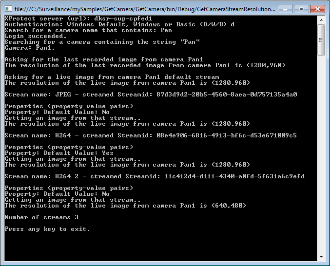

# Camera Stream Resolution

This sample shows how to find out what resolution there is in the images
from a certain camera at the time the sample is run. It also
demonstrates how to retrieve information about whether more streams are
running.

This sample is a console application, this ensures that the code is
small and simple.

When connected to the server it will find a camera which name contains a
specified string. It will then for the last recorded image from that
camera display the width and height, it will for a live image from the
camera display the width and height, it will now list the camera streams
running on the camera and for each stream display properties.

The capability of having more than one live stream only exists in the
XProtect Corporate and Expert version, this means the sample will only
return a list of stream in XProtect Corporate and Expert. The sample
will work for all versions of XProtect, in other XProtect versions you
will still get the recorded and the live image information.

## The sample demonstrates

- Login with credentials provided by operator
- Search for a camera using a string that is compared to the camera
  name
- Get the latest recorded image, and the resolution
- Get the default live image, and the resolution
- Get a list of the streams and properties belonging to each stream
- Get a live image from a specific stream, and the resolution of it

## Using

- VideoOS.Platform.Data.StreamDataSource
- VideoOS.Platform.Live.JPEGLiveSource
- VideoOS.Platform.Live.LiveContentEventArgs
- VideoOS.Platform.Data.JPEGVideoSource

## Environment

- .NET library MIP Environment

## Visual Studio C\# project

- [CameraStreamResolution.csproj](javascript:clone('https://github.com/milestonesys/mipsdk-samples-component','src/ComponentSamples.sln');)
