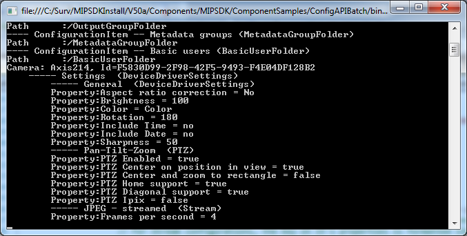

# Configuration API Batch

The ConfigAPIBatch sample reads through parts of a configuration and
dumps key ConfigurationItems and their properties.

Server name, user name and password are hardcoded in the sample, so
these must be changed before running it.

## The sample demonstrates

- How to navigate through the hierarchy of ConfigurationItems
- How to find specific properties, for example the FPS for cameras

## Using

- VideoOS.ConfigurationAPI namespace
- VideoOS.ConfigurationAPI.ConfigurationItem
- VideoOS.ConfigurationAPI.Property
- VideoOS.ConfigurationApi.ItemTypes

## Environment

- MIP .NET Library (Component Integration)

## Visual Studio C\# project

- [ConfigAPIBatch.csproj](javascript:clone('https://github.com/milestonesys/mipsdk-samples-component','src/ComponentSamples.sln');)
