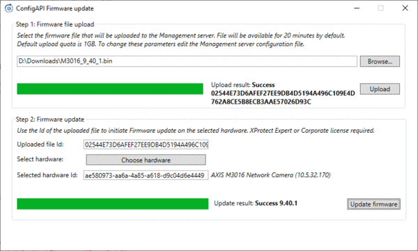

# Configuration API firmware update

This sample uses the Configuration API to get all hardware devices,
upload a firmware file, and update firmware on a single hardware device.

The sample uses the logon dialog to login to an XProtect Management
Server via the ServerCommandService, and uses the Configuration API to
get all hardware devices, upload the firmware file, and update firmware
on a single hardware device. Firmware files are stored on the Management
Server machine for 20 minutes and the storage quota is maximum 1 GB.
File storage settings can be changed from the Management Server
configuration file (ServerConfig.xml).

The following screenshot shows the main sample application window after
successful file upload and firmware update:

## The sample demonstrates

- How the Configuration API can be used to create client applications
- Construction of a ConfigurationApiService client
- How a firmware file can be transferred to the Management Server file storage
- How a single hardware device can be selected with ItemPickerForm
- How execution of hardware device firmware update can be done via the
  Configuration API

## Using

- VideoOS.ConfigurationAPI namespace
- VideoOS.ConfigurationAPI.ConfigurationItem
- VideoOS.ConfigurationAPI.Property
- VideoOS.ConfigurationApi.ItemTypes

## Environment

- MIP .NET Library (Component Integration)

## Visual Studio C\# project

- [ConfigAPIFirmwareUpdate.csproj](javascript:clone('https://github.com/milestonesys/mipsdk-samples-component','src/ComponentSamples.sln');)

## Special notes

Ensure that the provided firmware file is officially distributed by the
hardware device manufacturer, and that the firmware file can be used to
update the selected hardware device model. Milestone does not take
responsibility for hardware device malfunction if an incompatible
firmware file or hardware device is selected.
