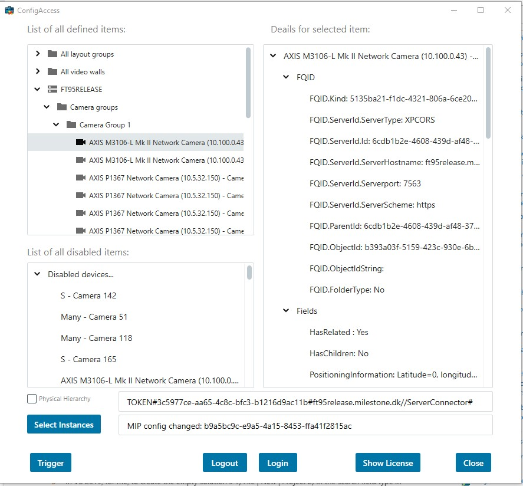
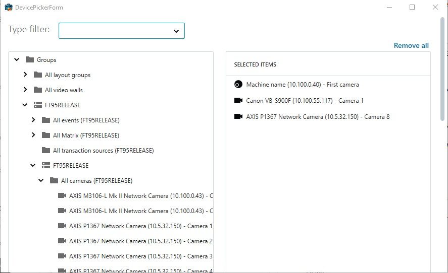

# Configuration Access

The ConfigAccessViaSDK sample can connect to an XProtect server, get the
entire configuration, and dump it into a listbox. For each item it
finds, it will ask for the children belonging to that item.

## The sample demonstrates

- Initialization of MIP .NET Library, when only configuration is required
- Access to VMS owned configuration, for example, servers and
  cameras groups
- A simple drill down of all Items via the Item.GetChildren() method.
- Launching the ItemPicker dialog to select one or more cameras from the
  loaded configuration.

## Using

- VideoOS.Platform.Configuration
- VideoOS.Platform.UI.ItemPickerWpfUserControl

## Environment

- MIP .NET library

## Visual Studio C\# project

- [ConfigAccessViaSDK.csproj](javascript:clone('https://github.com/milestonesys/mipsdk-samples-component','src/ComponentSamples.sln');)

## Special notes

This sample only needs access to configuration and the simple
ItemPickerWpfUserControl, and no need to display live video, the only 2
files which are required for deployment:

- VideoOS.Platform.dll
- VideoOS.Platform.SDK.dll

