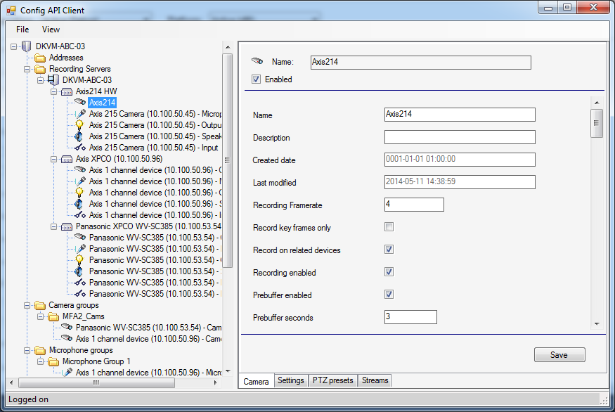

# Configuration API Client

This sample uses the Configuration API to get all configuration items
and to perform the changes done by the operator.

The ConfigAPIClient sample demonstrates:

-   How the Configuration API can be used to create client application
-   Construction of a client via ChannelFactory
-   How the Token is embedded in the SOAP Header
-   How ItemTypes can be interpreted for tree view display or tabs
-   How execution of server side methods is done

The sample uses the logon dialog to login to an XProtect server via the
ServerCommandService, and uses the Configuration API for getting all
configuration and performing the changes done by the operator.

Shows a treeview on the left hand side, and the content of the selected
item on the right hand side.

## Using

-   VideoOS.ConfigurationAPI.ConfigurationItem
-   VideoOS.ConfigurationAPI.Property
-   VideoOS.ConfigurationApi.ItemTypes
-   And many other classes from the VideoOS.ConfigurationAPI namespace

## Environment

-   MIP .Net Library (Component Integration) - Though it only uses the
    component for login

## Visual Studio C\# project

-   [ConfigAPIClient.csproj](javascript:openLink('..\\\\ComponentSamples\\\\ConfigAPIClient\\\\ConfigAPIClient.csproj');)

## Special notes

This is not intended as a production ready application, implementation
of exception handling, retry methods and more are incomplete.

The following functionality is not supported by the sample:

- Add or edit data for registration numbers under *LPR match lists*