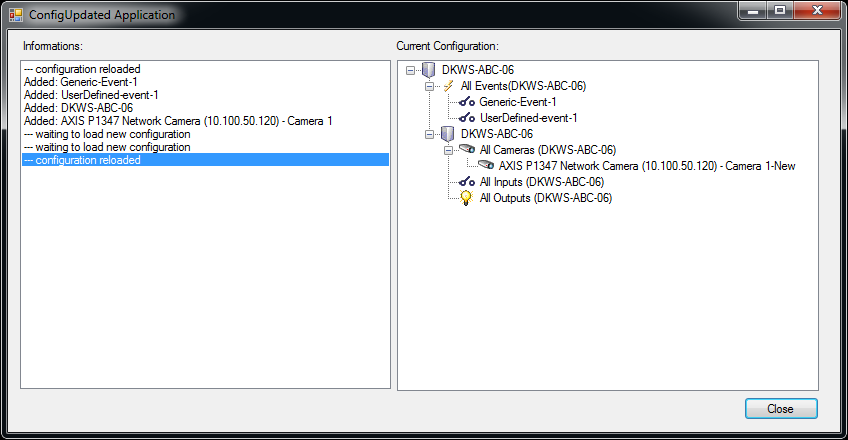

# Keep your configuration updated

This sample shows how you can keep your copy of the VMS configuration
updated with the latest changes done by the administrator

The sample will utilize the Event Server to listen for changes, via the
MessageCommunication classes. When changes happen a timer is started to
delay the configuration load. If new changes appear within the timer
delay, the timer is further delayed to wait for as many changes as
possible, before asking the server for a new configuration. This is done
to avoid loading the configuration every time the administrator presses
the \'save\' icon.

The sample has a delay of 15 seconds, but should be considered to be
higher for large systems.

## The sample demonstrates

-   How to listen for events after a system configuration update
-   How to ask .Net library to reload configuration

## Using

-   VideoOS.Platform.Environment
-   VideoOS.Platform.Messaging.MessageId.System.SystemConfigurationChangedIndication

## Environment

-   MIP .Net Library (Component Integration)

## Visual Studio C\# project

-   [ConfigUpdated.csproj](javascript:openLink('..\\\\ComponentSamples\\\\ConfigUpdated\\\\ConfigUpdated.csproj');)
