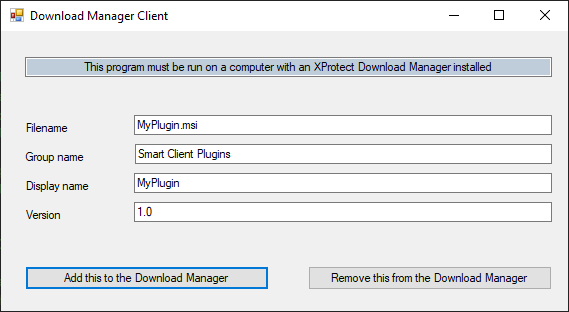
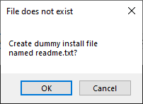
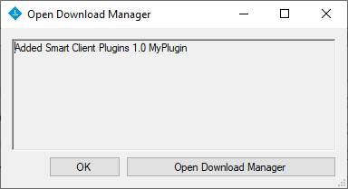
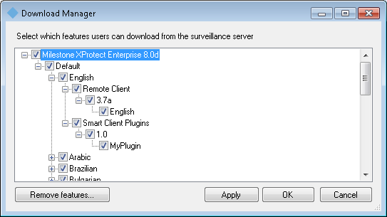
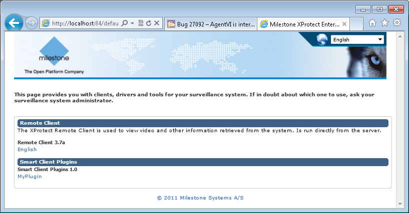

# Download Manager Client

The DownloadManagerClient is a sample of how you can add and remove your
installers or other files to the download page.

The code in this sample is expected to be used inside your own tool
without the UI, so the end user can simply run your tool and have your
plug-in placed on the download page without any questions or dialogs.

Before building the sample, you need to update the 3 SSCM dll references
(`SSCM.dll`, `SSCM.Interface.dll` and `SSCM.Interface.Retriever.dll`) to
point to the files located in the XProtect Download Manager installation
folder (typically
`C:\Program Files\Milestone\XProtect Download Manager\`).

Before running the sample (or your own tool/application), copy the build
application (include readme.txt) to the 'XProtect Download Manager'
installation folder. You need to copy the program files for the
application to work properly. You will not get an error if the
application is started in other folders, but you can\'t add or remove
plugin from the download page.

Run the sample as Administrator. The following dialog is displayed if
you just run the sample:

Even though we don\'t have a \'MyPlugin.msi\' installer file in this
sample, we can still press the **Add this \...** button and will see
this dialog:

Now press **OK**

Now the dummy text file has been added to the download page.

Further maintenance can be done in the Download Manager application.
This tool can be started by the button, or by selecting it in the
\"Start \> Milestone \> XProtect Download Manager\".

In this application you can remove and add features, available for
download. If you untick a program or feature, it is still installed on
the server, but not available for download. It can therefore be added
later again with a simple tick mark.

The `http://localhost/installation` page would now look like this:

## The sample demonstrates

- How to add a Smart Client plugin to the download page

## Using

- SSCM
- SSCM.Interface
- SSCM.Interface.Retriever

## Environment

- None

## Visual Studio C\# project

- [DownloadManagerClient.csproj](javascript:clone('https://github.com/milestonesys/mipsdk-samples-component','src/ComponentSamples.sln');)
