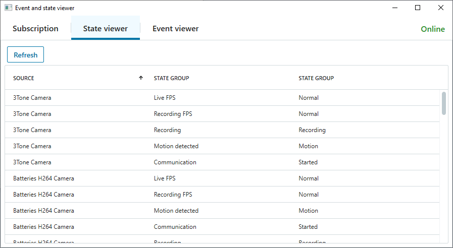

# Event and State Viewer

This sample demonstrates how to subscribe to events and state,
how to monitor the connection state, how to track and display the
current state, and how to display events.

The application consists of three tabs:

- **Subscription**
  - Subscription rules can be specified using the item picker
  - Available event types are looked up using the Configuration REST API
- **State viewer**
  - Contains local representation of the state matching the current subscription
  - The state is updated when stateful events are received
  - Names of events, state, and state groups are looked up using the Configuration REST API
- **Event viewer**
  - Contains a list of the last 100 events received 
  - The list is updated when events are received
  - Names of events and event sources (items) are looked up using the Configuration REST API




## The sample demonstrates

- How to subscribe to events based on sources, source types and/or event types
- How to get the current state based on an active subscription
- How to keep track of the state of configuration items based on stateful events
- How to monitor the connection state
- How to use the Configuration REST API to look up ids in the event: source, event type, and state group.

## Simplified example

```csharp
async Task SampleAsync()
{
    // TODO: Initialize SDK environment and login

    var loginSettings = LoginSettingsCache.GetLoginSettings(EnvironmentManager.Instance.MasterSite);

    // Create event receiver and session
    var eventReveiver = new EventReceiver();
    var session = EventsAndStateSession.Create(loginSettings, eventReveiver);

    // Add subscription
    var subscription = new[]
        {
            new SubscriptionRule(
                Modifier.Include,
                new ResourceTypes(new[]{ "cameras" }),
                SourceIds.Any,
                new EventTypes(new[]{ KnownStatusEvents.CommunicationStarted, KnownStatusEvents.CommunicationStopped }))
        };
    await session.AddSubscriptionAsync(subscription, default);

    // Send initial state as events, if needed
    await _session.SendAllStatefulEventsAsync(default);

    // TODO: Run application

    // Dispose session to close the connection
    session.Dispose();
}

class EventReceiver : IEventReceiver
{
    public async Task OnConnectionStateChangedAsync(ConnectionState newState)
    {
        // TODO: Handle connection state change
    }

    public async Task OnEventsReceivedAsync(IEnumerable<Event> events)
    {
        // TODO: Handle events
    }
}
```

## Using

- VideoOS.Platform.EventsAndState.EventsAndStateSession
- VideoOS.Platform.EventsAndState.IEventsAndStateSession
- VideoOS.Platform.EventsAndState.IEventReceiver
- VideoOS.Platform.EventsAndState.SubscriptionRule
- VideoOS.Platform.EventsAndState.Event
- VideoOS.Platform.Configuration
- VideoOS.Platform.Proxy.RestApi.RestApiClient
- VideoOS.Platform.UI.ItemPickerWpfWindow
- VideoOS.Platform.UI.Controls.VideoOSTabControlPrimaryHorizontalLarge
- VideoOS.Platform.UI.Controls.VideoOSTable


## Environment

- MIP .NET library

## Visual Studio C\# project

- [EventAndStateViewer.csproj](javascript:clone('https://github.com/milestonesys/mipsdk-samples-component','src/ComponentSamples.sln');)
