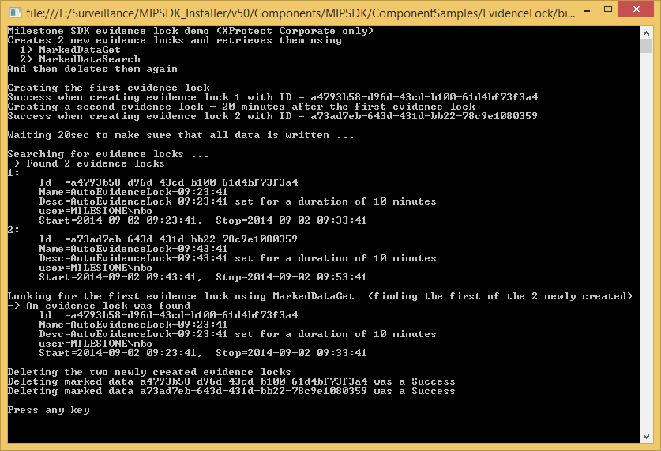

# Evidence Lock

This sample demonstrates how to use a WCF proxy to create and manipulate
evidence locks.

A WCF proxy used for manipulating evidence locks is included in this
sample. However, it is easy to create one yourself. We did it by using
the svcutil.exe program that comes with Visual Studio. In order to
create your own proxy, you need to open a Visual Studio Command Prompt
and use the following command-line to create the proxy:

~~~ cmd
svcutil http://<host>/ManagementServer/ServerCommandService.svc /namespace:*,EvidenceLock.WcfProxy /targetClientVersion:Version35 /noConfig /out:<destination_dir>\ServerApiSvc.cs
~~~

If you want to create your own proxy, replace \<host\> with the hostname
of the server where the management server is running and
\<destination_dir\> with the destination where the proxy will be placed.
You can also change the namespace, if you wish. There are many other
options to this tool, and you can read more about it at
<a href="https://docs.microsoft.com/en-us/dotnet/framework/wcf/servicemodel-metadata-utility-tool-svcutil-exe" class="uri" target="_blank">ServiceModel Metadata Utility Tool (Svcutil.exe)</a>.

After the login is successful, the sample will automatically perform
these evidence lock operations:

-   Create first evidence lock
-   Create a second evidence lock
-   Look for evidence locks using MarkedDataSearch
-   Look for the first evidence lock using MarkedDataGet
-   Delete the two newly created evidence locks using MarkedDataDelete

## The sample demonstrates

-   Use of a WCF proxy to create, get and delete evidence locks

## Using

-   Generated Server Command Service proxy

## Environment

-   MIP .NET library

## Visual Studio C\# project

-   [EvidenceLock.csproj](javascript:openLink('..\\\\ComponentSamples\\\\EvidenceLock\\\\EvidenceLock.csproj');)

## Notes

Only XProtect Corporate supports evidence locks.
