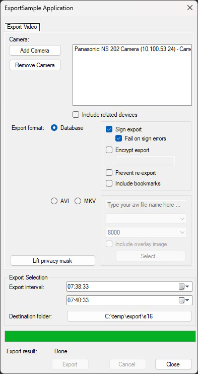

# Export Sample

This sample shows how to export video and related audio and metadata stored in XProtect
systems.

## The sample demonstrates

-   How to use the export classes for AVI, MKV and Database export

## Using

-   VideoOS.Platform.Data.AVIExporter class
-   VideoOS.Platform.Data.DBExporter class
-   VideoOS.Platform.Data.MKVExport class

## Environment

-   MIP .NET library

## Visual Studio C\# project

-   [ExportSample.csproj](javascript:openLink('..\\\\ComponentSamples\\\\ExportSample\\\\ExportSample.csproj');)
