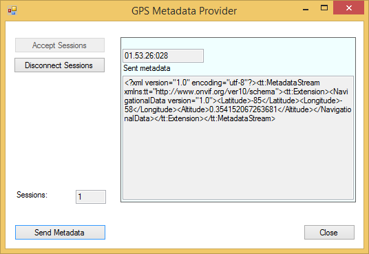

# GPS Metadata Provider

This sample shows how GPS metadata can be injected into an XProtect
system.

The sample uses the C\# .Net MIP SDK Library for all communication and
synchronization, while the sample only needs to focus on providing
metadata. The sample supports multiple simultaneous connections, e.g.
metadata can be distributed to two XProtect Recording servers.
Furthermore, this sample demonstrates the push-functionality of
metadata, which is in contrast to the video provider, where data is
polled. Thus it is possible to send metadata at will and even have long
pauses in the data.

The MIP Driver with metadata support is part of the normal Device Packs
from version 7.3.

## How to use this sample

-   Start this sample
-   Click the \"Accept Sessions\" button
-   Start the Management Client
-   Start the add hardware wizard
-   Add username and password to the search list: \"root\", \"password\"
-   Select to use the \"MIP Driver\"
-   Enter IP address of the machine this sample is running on, and port
    52123
-   Continue with next steps until done
-   Click the \"Send Metadata\" button to send a single packet of
    (semi-random) metadata. Each click will send one packet

## The sample demonstrates

-   How GPS metadata can be stored in XProtect
-   How to support multiple server channels simultaneously

## Using

-   VideoOS.Platform.Data.MediaProviderService
-   VideoOS.Platform.Data.HardwareDefinition
-   VideoOS.Platform.Data.MetadataProviderChannel
-   VideoOS.Platform.Data.MetadataDeviceDefintion
-   VideoOS.Platform.Metadata.MetadataSerializer

## Environment

-   MIP .NET library

## Visual Studio C\# project

-   [GpsMetadataProvider.csproj](javascript:openLink('..\\\\ComponentSamples\\\\GpsMetadataProvider\\\\GpsMetadataProvider.csproj');)
