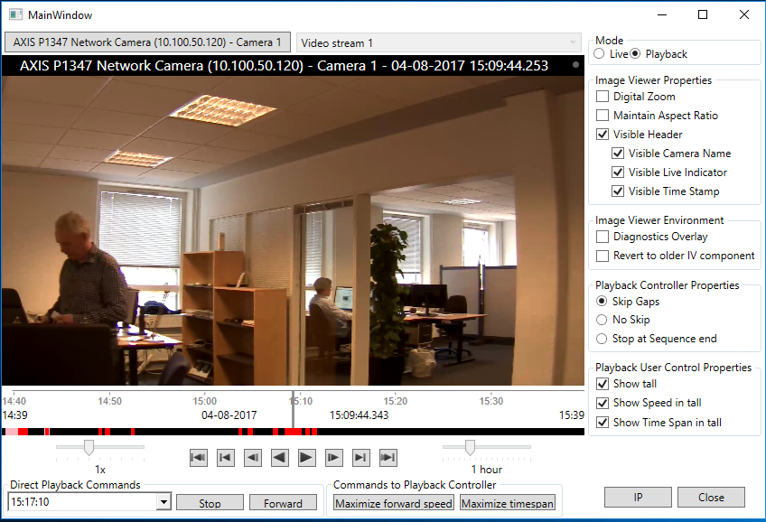

# Utilize ImageViewerWpfControl and PlaybackWpfUserControl

The ImageViewerClient sample demonstrates how to show playback and live
video for a selected camera. The user will get a login dialog, once
logged in a camera can be chosen using the ItemPickerForm.

Navigating the playback video is done using a PlaybackWpfUserControl, a
control that to some degree resembles the time line and playback user
control as known from the Smart Client. The user can digitally zoom and
choose whether the images are scaled to the control in a way where
aspect ratio of the images is maintained or not.

The user can experiment with playback control, whether to skip gaps in
recorded footage or not or stop the playback when a gap is encountered.

## The sample demonstrates

-   Connection and login
-   Initialization of MIP .Net Library, when video display is required
-   Video display playback and live
-   Tall and short version mode of the PlaybackWpfUserControl can be
    chosen by user
-   Will start with default live stream and switch between multiple live
    streams (if multiple live streams are configured for the camera)
-   Demonstrates playback behavior when there are pauses in recorded
    footage. Three options can be chosen: Skip gaps, no skip or stop
    playback at sequence end
-   Diagnostics overlay for video rendering can be enabled
-   You can request the information on the IP address of the camera
-   Working with exported files (called offline mode)
-   Playing audio stream as well as video stream

## Using

-   VideoOS.Platform.Client.PlaybackWpfUserControl
-   VideoOS.Platform.Client.ImageViewerWpfControl
-   VideoOS.Platform.Messaging.MessageId.SmartClient.PlaybackCommand
-   VideoOS.Platform.Messaging.MessageId.Server.GetIPAddressRequest

## Environment

-   MIP .Net Library (Component Integration)

## Visual Studio C\# project

-   [ImageViewerClient.csproj](javascript:openLink('..\\\\ComponentSamples\\\\ImageViewerClient\\\\ImageViewerClient.csproj');)
