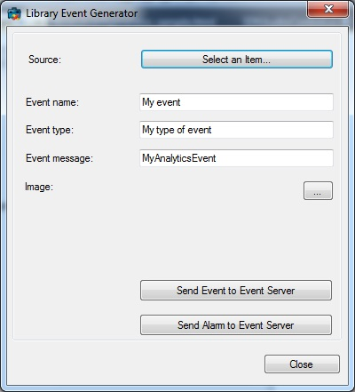
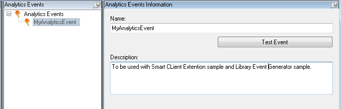

# Library Event Generator

This sample shows how to generate and send an Analytics event to the
Event Server.

This sample gives the option of relating the event to a well-known item
via the source selection button, for example, a camera or a
plugin-defined item.

The application will log in to a Milestone server to get the list of
well known items.

When pressing the \"Send Event to Event Server\" button an Analytics
Event is created and sent to the Event Server using the NewEventCommand
message. The Event Server will check all defined Alarm Definitions for a
match on message and source, and if so create an alarm.

When pressing the \"Send Alarm to Event Server\" button an Alarm is
created and sent to the Event Server using the NewAlarmCommand message.
The Event Server will immediately store the Alarm in the database.

The result of the above actions can be seen on the \"Alarm Workspace\"
in the Smart Client.

## How to configure and run the sample

1.  Setup an analytics event named MyAnalyticsEvent in your XProtect
    Administrator Client / Administrator.
2.  Setup an alarm that is created based on the analytics event (the
    name configured above)

In the Management Client you need to create an Analytics Event called
\"MyAnalyticsEvent\"

## The sample demonstrates

-   How to create a new event using a MIP message

## Using

-   VideoOS.Platform.Messaging
-   VideoOS.Platform.Data.AnalyticsEvent

## Environment

-   MIP .NET library

## Visual Studio C\# project

-   [LibraryEventGenerator.csproj](javascript:openLink('..\\\\ComponentSamples\\\\LibraryEventGenerator\\\\LibraryEventGenerator.csproj');)
