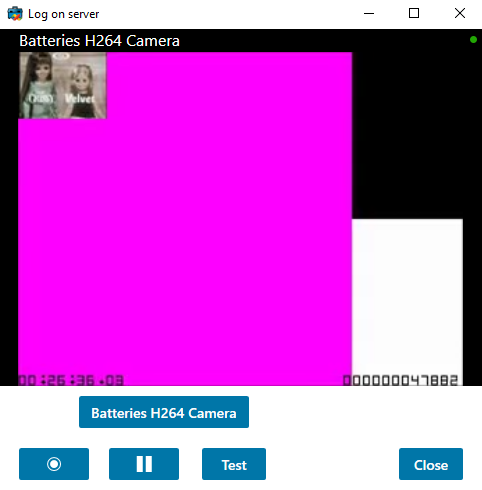

# Log Message To Server

The LogToServer sample shows how specific messages can be logged on an
XProtect server.

When logging messages to a server, translation of the message to
multiple languages need to be possible, and this sample shows how that
can be done.

When the start-recording and stop-recording buttons are pressed, a log
message is also written to the system log.

When the Test button is pressed, two messages that could relate to
access control are sent to the audit log.

## The sample demonstrates

- How to define new log messages
- How to write to the XProtect logs

## Using

- VideoOS.Platform.Log.LogMessage
- VideoOS.Platform.Log.LogMessageDictionary
- VideoOS.Platform.Log.LogClient

## Environment

- All Environments

## Visual Studio C\# project

- [LogOnServer.csproj](javascript:clone('https://github.com/milestonesys/mipsdk-samples-component','src/ComponentSamples.sln');)
