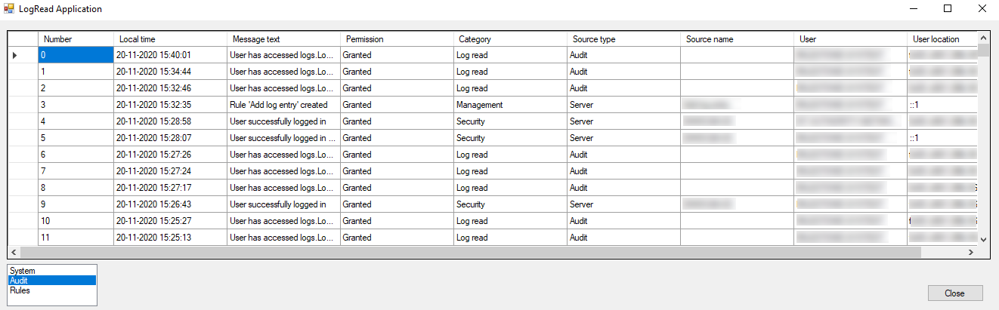

# Log Read

The LogRead sample shows how to read logs from XProtect VMS system.

Logs saved to XProtect VMS system are grouped into log groups. This
sample shows how to read those groups from the server and how to read
logs from a specific group.

When application starts, log groups are loaded from the server. Once the
group is selected, log entries from the log group are displayed in the
grid.

## The sample demonstrates

- How to read groups of events logged to XProtect VMS system
- How to read log entries belonging to a log group from XProtect VMS system

## Using

- VideoOS.Platform.Log.LogClient

## Environment

- MIP .NET library

## Visual Studio C\# project

- [LogRead.csproj](javascript:clone('https://github.com/milestonesys/mipsdk-samples-component','src/ComponentSamples.sln');)
