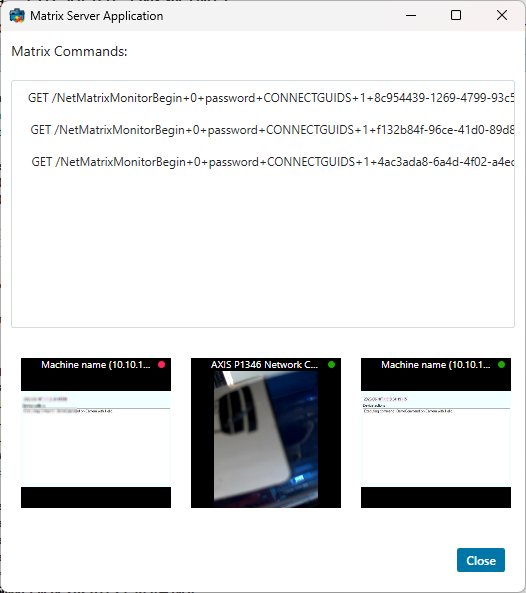

# Matrix Server

This sample show how to receive matrix commands from a Milestone VMS
system.

This can be used to get immediate notification based on an event or user
action. The notification contains a camera id, but nothing else.

For this sample to work, the Management Client needs to have a matrix
definition added with an IP address pointing to the machine running the
MatrixServer, port set to 12345 and password set to \"password\" (on VMS versions prior to 2022 R2 type should be
set to Smart Client/Remote Client).

After this application is started, matrix commands can be fired from
Smart Client (Send to Matrix option in the camera toolbar) or via event configuration.

The listbox will contain one line for every matrix command being
received. If the command is understood and password is correct, the
camera being referenced will be displayed below on a row of 3 cameras.

## The sample demonstrates

-   How to receive matrix commands from VMS servers

## Using

-   VideoOS.Platform.UI.LogonDialog
-   Matrix protocol

## Environment

-   .NET library MIP Environment

## Visual Studio C\# project

-   [MatrixServer.csproj](javascript:openLink('..\\\\ComponentSamples\\\\MatrixServer\\\\MatrixServer.csproj');)
