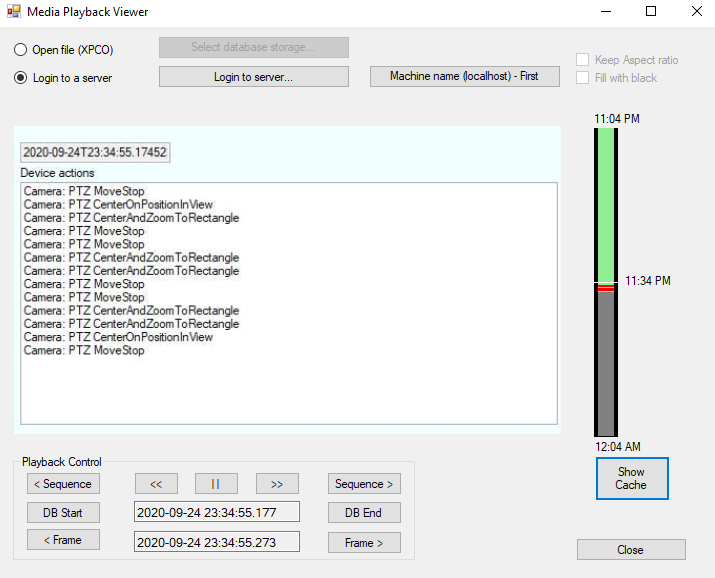

# Media Playback Viewer

The MediaPlaybackViewer shows how to use the Media toolkit for
retrieving stored video.

The media toolkit is able to retrieve video from any XProtect server,
via the Image Server protocol, or by reading video database files
directly.

## MIP Environment - .Net Library

The two buttons below the image are used for selecting what video to
look at, e.g. the source. Only one is active in this sample.

When a source has been selected, the bottom left part can be used like
any normal navigation and playback of the selected video.

On the right hand side, there is a simple timeline display -- the entire
code is part of the sample. Mouse dragging on this control will also
adjust the time for the displayed images.

## The sample demonstrates

-   Use of media toolkit for playback
-   Handling and control of the PlaybackController
-   Handling of threads while using media toolkit and UI forms controls

## Using

-   VideoOS.Platform.Data.JPEGData
-   VideoOS.Platform.Client.PlaybackController

## Environment

-   .NET library MIP Environment

## Visual Studio C\# project

-   [MediaPlaybackViewer.csproj](javascript:openLink('..\\\\ComponentSamples\\\\MediaPlaybackViewer\\\\MediaPlaybackViewer.csproj');)
