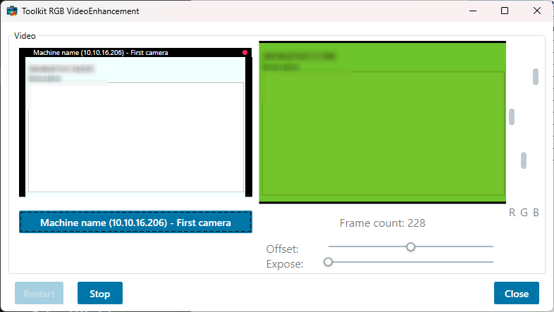

# Media RGB Video Enhancement Live

This sample shows how to utilize the media toolkit for enhancing images
in live mode.

The sample has an ImageViewerWpfControl shown as a reference, and an
Image control showing the same video as it has been enhanced. 5 sliders are
used to instruct the enhancement method of how to change the red, green
and blue pixels for each frame.

The sample is written in C\# and using a C++ DLL for doing the pixel
modification. The C++ DLL is part of the sample.

The communication is using an IntPtr from the C++ DLL into a new C\#
Bitmap for displaying the enhanced frames.

The above screenshot contains the same live image in both displays,
where the left hand side is the original, and the right hand side has
been 'enhanced' with focus on the red color plane.

## The sample demonstrates

- How to use the media toolkit in a standalone application

## Using

- VideoOS.Platform.Live.BitmapLiveSource
- VideoOS.Platform.Live.LiveSourceBitmapContent

## Environment

- .NET library MIP Environment

## Visual Studio C\# project

- [MediaRGBVideoEnhancementLive.sln](javascript:clone('https://github.com/milestonesys/mipsdk-samples-component','src/ComponentSamples.sln');)
