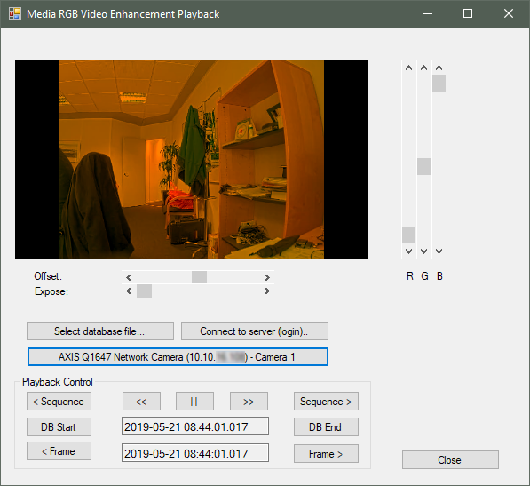

# Media RGB Video Enhancement Playback

This sample shows how to get hold of recorded video and show each frame
with some enhancement.

The recorded video can be selected from either a XProtect server, or
directly from selecting a folder / file containing a XProtect database.

The sample has a picturebox showing the same video as it has been
enhanced. 5 sliders are used to instruct the enhancement method of how
to change the red, green and blue pixels for each frame.

The sample is written in C\# and using a C++ DLL for doing the pixel
modification. The C++ DLL is part of the sample.

The communication is using an IntPtr from the C++ DLL into a new C\#
Bitmap for displaying the enhanced frames.

## MIP Environment - .NET Library

The video enhancement options are the same as for the RGB Video
Enhancement plug-in sample in the Smart Client as well as the Media RGB
Enhancement Playback.

This sample also has two buttons for selecting either a file or a camera
to be supplying the frames.

When a source has been selected, control can be performed using the
buttons at the bottom.

The playback is handled by the PlaybackController class.

## The sample demonstrates

- Use of media source toolkit for accessing locally stored video databases
- Use of the PlaybackController when looking at a database

## Using

- VideoOS.Platform.Data.BitmapVideoSource
- VideoOS.Platform.Messaging.MessageId.SmartClient.PlaybackCommand

## Environment

- .NET library MIP Environment

## Visual Studio C\# project

- [MediaRGBVideoEnhancementPlayback.sln](javascript:clone('https://github.com/milestonesys/mipsdk-samples-component','src/ComponentSamples.sln');)
