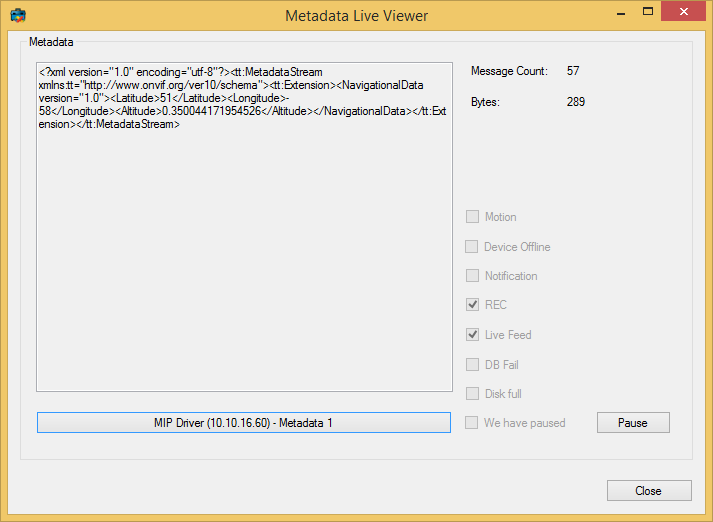

# Metadata Live Viewer

The Metadata Live Viewer sample shows how to use the metadata features
through a C\# application. In this sample it will receive metadata from
a source by using the `MetadataLiveSource` class.

## MIP Environment - .NET Library

While showing the live metadata as XML as they are coming from the media
toolkit, the metadata XML packet size is displayed in the top right hand
corner. The total number of packets received is also shown.

The disabled check boxes show the information that are received in the
live status messages.

## The sample demonstrates

- How to effectively retrieve metadata from XProtect servers
- How to interpret live status messages
- Handling of renewing login token

## Using

- VideoOS.Platform.Live.MetadataLiveSource
- VideoOS.Platform.Live.MetadataLiveContent

## Environment

- .NET library MIP Environment

## Visual Studio C\# project

- [MetadataLiveViewer.csproj](javascript:clone('https://github.com/milestonesys/mipsdk-samples-component','src/ComponentSamples.sln');)
