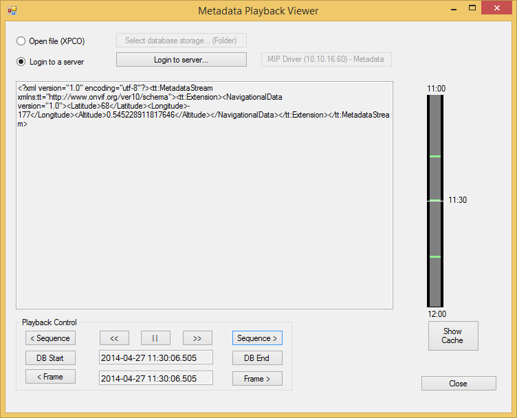

# Metadata Playback Viewer

The Metadata Playback Viewer sample shows how to use the MIP classes for
retrieving stored metadata.

The media toolkit is able to retrieve metadata from an XProtect
installation, or by reading XProtect database files directly.

At the top of the sample, the source of the metadata is chosen. If a
file is chosen, the user must choose the folder where the metadata
database is located. If a server is chosen, the user must first login to
the server and then choose the metadata device. When a source has been
selected, the metadata is displayed as XML in the window in the middle
and the bottom left part can be used like any normal navigation and
playback of the selected metadata. On the right hand side, there is a
simple timeline display -- the entire code is part of the sample. Mouse
dragging on this control will also adjust the time for the displayed
data.

## The sample demonstrates

-   How to do playback of metadata with the
    VideoOS.Platform.Data.MetadataPlaybackSource class
-   How to traverse metadata back and forth in time
-   Handling of threads while using media toolkit and UI Forms controls

## Using

-   VideoOS.Platform.Data.MetadataPlaybackSource
-   VideoOS.Platform.Data.MetadataPlaybackData

## Environment

-   .NET library MIP Environment

## Visual Studio C\# project

-   [MetadataPlaybackViewer.csproj](javascript:openLink('..\\\\ComponentSamples\\\\MetadataPlaybackViewer\\\\MetadataPlaybackViewer.csproj');)
