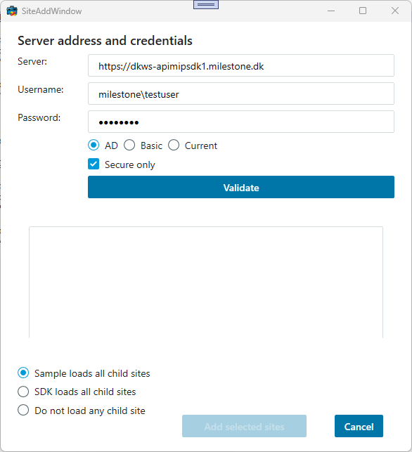
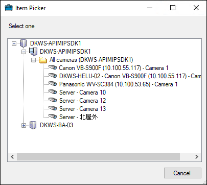
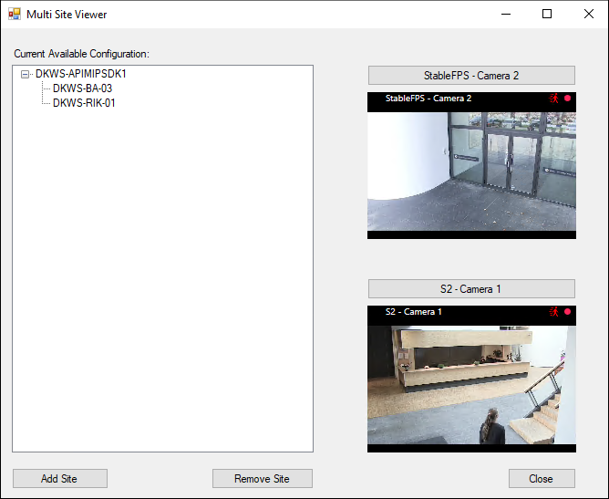

# Multi-Site Viewer

Multiple XProtect systems can be accessed from one application as shown
by this sample.

The logon credentials and domain can be different for every system you
add. This sample only allows for two systems, but there is no limit to
how many systems you can access at once.

When all the XProtect systems have been added, the rest of the
application can operate as if it is one configuration. The built-in
ItemPicker component, the ImageViewerControl and PlaybackController can
handle cameras, no matter what site they are located on.

For information about login, please refer to <a href="https://doc.developer.milestonesys.com/html/index.html?base=gettingstarted/intro_environments_login.html&tree=tree_4.html" target="_top">Introduction to MIP Environments and Login</a>

## MIP Environment - .NET Library

The above dialog adds a site and potentially all child sites known by
this site using Windows AD authentication.

Here we see the same dialog after having used the Validate button.

The options for adding child sites:

- Include all child sites now: Will add all child sites during the add
  process
- Delay include all child sites: Will wait to include until needed, in
  this sample by the ItemPicker
- Do not include any child sites: Will only add the site selected

After the login to the above two XProtect systems, all cameras and other
known items are available for selection, as can be seen from the above
ItemPicker dialog.

The main dialog show the already selected sites on the left hand side,
and two ImageViewerControls on the right hand side. In this screenshot,
cameras from two different XProtect systems are shown at the same time.

## The sample demonstrates

- How to access video from multiple XProtect systems simultaneously
- How to work with XProtect sites

## Using

- VideoOS.Platform.Client.ImageViewerControl
- VideoOS.Platform.UI.ItemPickerForm
- VideoOS.Platform.SDK.Environment.LoadSiteItem method

## Environment

- .NET library MIP Environment

## Visual Studio C\# project

- [MultiSiteViewer.csproj](javascript:clone('https://github.com/milestonesys/mipsdk-samples-component','src/ComponentSamples.sln');)
