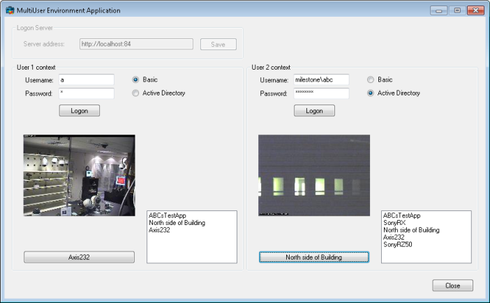

# Multi-User Environment

When the same set of XProtect servers needs to be accessed by multiple
different users through the same application, a UserContext class can be
utilized for separating each user\'s configuration and logon.

This can be useful e.g. when you are making a server service that
provide some web service support for many users.

Each user can login and have a different view of the configuration,
depending on access rights, while still maintaining login credentials
and token separately.

In this application you type the XProtect server address just once, and
afterwards you can login as two different users to the defined server.

Below the logon buttons, you can then select a camera and view video.

Next to each ImageViewerControl is a listbox containing the cameras each
user has access to. In this screen shot, the right hand user has access
to 5 cameras while the left hand user only has access to 3 cameras.

## The sample demonstrates

-   How a single instance of the .Net Library can hold multiple users\'
    configuration at one time

## Using

-   VideoOS.Platform.SDK.MultiUserEnvironment
-   VideoOS.Platform.Live.JPEGLiveSource

## Environment

-   .NET library MIP Environment

## Visual Studio C\# project

-   [MultiUserEnvironment.csproj](javascript:openLink('..\\\\ComponentSamples\\\\MultiUserEnvironment\\\\MultiUserEnvironment.csproj');)
