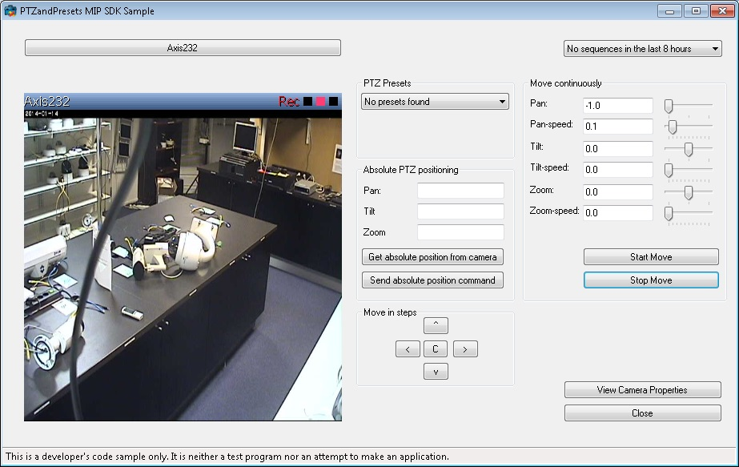

# PTZ and Presets

The PTZ and Presets sample enables the operator to do PTZ control while
showing live video for a selected camera. The camera is selected using
the ItemPickerForm which will show only the available PTZ cameras on the
VMS.

The detected presets are listed in a drop-down list. When you select a
preset in the combo box, the camera will be instructed to go to that
preset. When you press any of the arrow keys, the camera will be
instructed to move up, down, left, or right.

## The sample demonstrates

-   Connection and login without using the LoginForm and the ItemPicker
    pre-made dialogs
-   Initialization of MIP .Net Library, when video display is required
-   Video display -- live
-   PTZ control
-   Enumerate and go to presets

## Using

-   VideoOS.Platform.ClientControl
-   VideoOS.Platform.UI.ImageViewerControl
-   VideoOS.Platform.Messaging

## Environment

-   MIP .NET library

## Visual Studio C\# project

-   [PTZandPresets.csproj](javascript:openLink('..\\\\ComponentSamples\\\\PTZandPresets\\\\PTZandPresets.csproj');)

## Special notes

This sample needs access to configuration and use of ImageViewerControl
for video display.

Please use the CopyUIFiles.bat file for copying the correct files from
the MIPSDK folder to your folder, e.g. have this in the post-build
event:

~~~ cmd
cd "$(ProjectDir)..\..\bin"
call CopyUIFiles.bat "$(TargetDir)"
~~~

The reason for using this bat file is to allow for updating to new
MIPSDK versions and get any new or changed files included.
