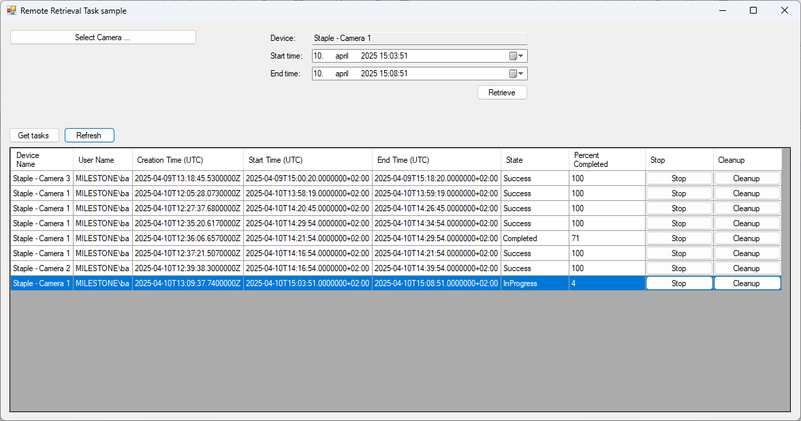

# Remote Retrieval Task

This sample shows how to control the retrieval of video from an edge
device into the Recording Server.

After selecting a camera, the list of current task is fetched from the
Management Server and displayed, afterwards new tasks can be submitted
to retrieve video from the edge device within a given time interval and
store this in the Recording Server.

## The sample demonstrates

- How to manage upload of video from edge devices to the Recording Server

## Using

- VideoOS.Platform.ConfigurationItems.Camera.RetrieveEdgeStorage
- VideoOS.Platform.ConfigurationItems.ManagementServer.LoadTasks	

## Environment

- .NET library MIP Environment

## Requirements

- MIP SDK 2025R2 or later
- XProtect VMS 2025R2 or later

## Visual Studio C\# project

- [RemoteRetrievalTaskSample.csproj](javascript:clone('https://github.com/milestonesys/mipsdk-samples-component','src/ComponentSamples.sln');)
