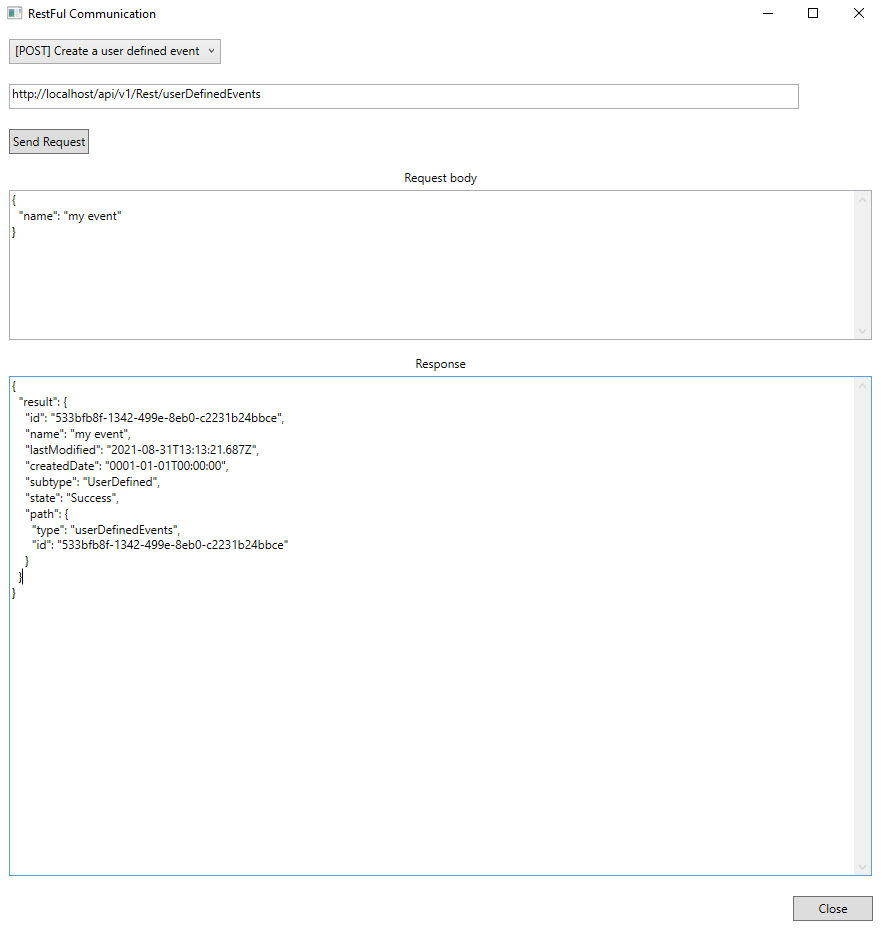

# RESTful Communication - MIP .NET

The RestfulCommunication sample demonstrates how to create, get, update and delete a user-defined event. The sample also shows how to invoke a ptzPresets task on a camera that supports PTZ. The status of the invoked task can be seen using the sample.

Making the REST API call is done using a bearer token in the authorization header. A token cache holds the current token that gets refreshed every hour internally. The token cache is set by the MIP SDK upon successful login.



## Prerequisites

- XProtect 2021 R2 or later
- The API Gateway installed on the same host as the management server
- A basic user with the Administrators role
- A PTZ camera with PTZ Presets (needed to test "cameras and tasks"; the sample
  can be run without a PTZ camera)

## The sample demonstrates

- Getting all user-defined events
- Getting information about a specific user-defined event with resources and definitions
- Updating a user-defined event
- Deleting a user-defined event
- Getting a list of cameras
- Getting a list of available ptzPresets tasks for a camera that supports PTZ
- Invoking and getting the status of a ptzPresets task on a camera that supports PTZ

## Notes

### Tasks

In this sample, if the selected request URI contains the placeholder parameters *`{userDefinedEventId}`*, *`{ptzCameraId}`*, *`{task}`*, or *`{taskId}`*, you must replace the placeholder with a proper value before sending the request.

When you get all the available tasks for a PTZ camera, the response body will look like this:

```json
{
    "tasks": [
        {
            "id": "DefaultPtzPreset",
            "displayName": "Set default PTZ preset"
        },
        {
            "id": "GetDevicePresets",
            "displayName": "Get presets from camera"
        }
    ]
}
```

To invoke a task you, provide the `id` value (e.g. `"DefaultPtzPreset"`, `"GetDevicePresets"` etc.) as a *`{task}`*.

The response body will have the `id` value of the invoked task (in this case `81`) as shown below:

```json
{
    "result": {
        "sessionDataId": 0,
        "state": "Idle",
        "path": {
            "type": "tasks",
            "id": "81"
        }
    }
}
```

The status of the task can be checked using the `id` value as *`{taskId}`* in the request URI, and the final result will look like:

```json
{
    "data": {
        "displayName": "invokeResult",
        "progress": 100,
        "cameraPath": {
            "type": "cameras",
            "id": "93345da5-de2b-415c-afe3-968f4b28cccd"
        },
        "sessionDataId": 6,
        "affectedProfileIds": [],
        "state": "Success",
        "relations": {
            "parent": {
                "type": "sites",
                "id": "bc4fe0ba-186f-40bc-ab6e-704d55a0aff5"
            },
            "self": {
                "type": "tasks",
                "id": "81"
            }
        }
    }
}
```

## Using

- VideoOS.Platform.SDK
- RESTful API  

## Related samples

- ProtocolSamples/RestfulCommunicationPython

## Environment

- MIP .NET Library (Component Integration)

## Visual Studio C\# project

- [RestfulCommunication.csproj](javascript:openLink('..\\\\ComponentSamples\\\\RestfulCommunication\\\\RestfulCommunication.csproj');)
