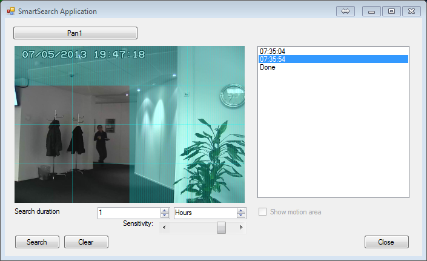

# Smart Search

This sample shows how to run and get results from a server side Smart
Search.

The Smart Search functionality might be familiar to you from the Smart
Client. In this sample, you can get a list of timestamps where motion
was detected after setting a time span, the motion detection threshold,
and a motion detection mask.

1. Run the SmartSearch sample.
2. Log in to an XProtect VMS.
3. Select a camera.
4. Optionally, change the search duration. The end of the time span
   will be when you click the Search button.
5. Optionally, change the motion detection threshold. The left-most
   position sets the highest sensitivity.
6. Optionally, add a motion detection mask. The image area is divided
   into 4 x 4 tiles. Drag within a tile to add it to the mask. Clear
   the mask by clicking the Clear button.
7. Run the search by clicking the Search button.
8. As the search results are returned, timestamps (UTC Z) will show up
   in the list on the right-hand side. Click a timestamp to display the
   corresponding image.

You will be able to display an overlay on the image that illustrates
where on the image motion was detected. The Show motion area checkbox
controls this.

## The sample demonstrates

- Using the Smart Search functionality
- Some methods of overlaying graphics

## Using

- RecorderCommandService.SmartSearchStart
- SmartSearchGetStatus
- SmartSearchGetResult
- VideoOS.Platform.Data.JPEGVideoSource

## Environment

- MIP .NET library

## Visual Studio C\# project

- [SmartSearch.csproj](javascript:clone('https://github.com/milestonesys/mipsdk-samples-component','src/ComponentSamples.sln');)
