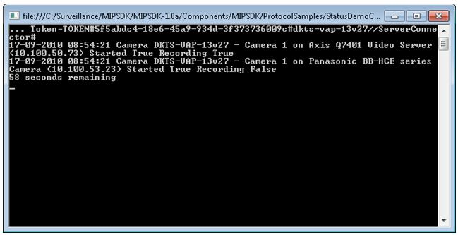

# Status Console

This sample shows how to access the Status API to retrieve status and
events from the system.

The sample is a console application to make the code as simple as
possible, while still demonstrating the key access methods.

The application takes the name of the XProtect Management Server as an
argument on the command line. It will initialize the
VideoOS.Platform.SDK environment, log in to the Management Server and
then identify one random recorder in the configuration.

When connecting to this recorder, the application will create a list of
all events and cameras for any event from or relating to any of these.

The application will dump any state changes and events that occur while
the application is running.

## The sample demonstrates

-   How to access the Status API
-   Provide a list of well-known event IDs

## Using

-   VideoOS.Platform.SDK.Proxy.Status

## Environment

-   None

## Visual Studio C\# project

-   [StatusDemoConsole.csproj](javascript:openLink('..\\\\ComponentSamples\\\\StatusDemoConsole\\\\StatusDemoConsole.csproj');)
