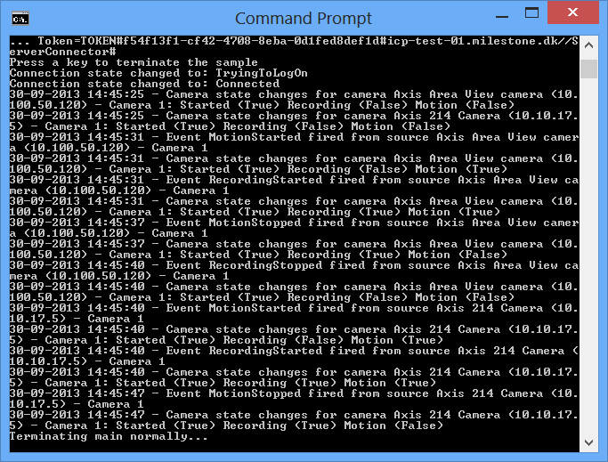

# Status Session Console

This sample shows how to access the Status API to retrieve status and
events from the system using the StatusSession client. This client is an
abstraction of the raw SOAP proxy and it takes care of establishing a
connection and reconnecting in case of a failure or failover.

The sample is a console application to make the code as simple as
possible, while still demonstrating the key access methods.

The application takes the name of the Management Server as an argument
on the command line. It will initialize the VideoOS.Platform.SDK
environment, log in to the Management Server using the credentials of
the user running the sample and then identify one random recorder in the
configuration. If another account is needed to login, the source code
must be changed to use the appropriate account. Comments in the source
code show how to do this.

When connecting to this recorder, the application will create a list of
all events and cameras for any event from or relating to any of these.

The application will dump any state changes and events that occur while
the application is running.

## The sample demonstrates

- How to access the Status API using the StatusSession client.
- Provide a list of well-known event IDs.
- Find all cameras on a Recording Server

## Using

- VideoOS.Platform.SDK.StatusSession
- Event arguments in the
  `VideoOS.Platform.SDK.StatusClient.StatusEventArgs` namespace

## Environment

- None

## Visual Studio C\# project

- [StatusSessionConsole.csproj](javascript:clone('https://github.com/milestonesys/mipsdk-samples-component','src/ComponentSamples.sln');)
