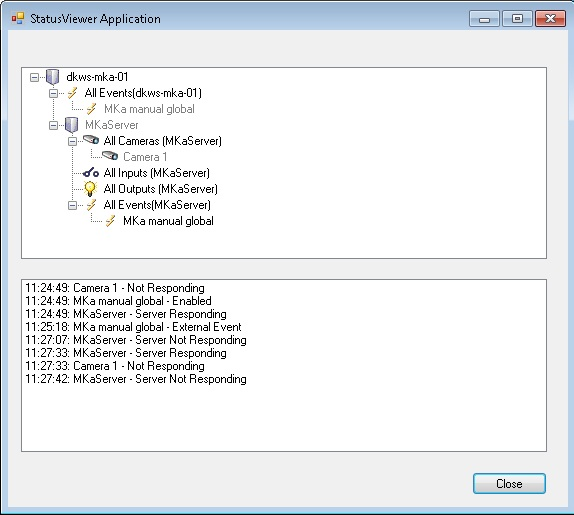

# Status Viewer

This sample shows how to dynamically show status on items such as
server, camera, event etc. All valid items are retrieved and presented
in a tree. When state has changed or an event has been triggered, the
tree item\'s color is updated and the update is listed in a list box.

## The sample demonstrates

- How to listen for new events.
- How to get configuration items.
- How to request item state changes.
- How to listen for item state changes.

## Using

- VideoOS.Platform.Messaging.Message
- VideoOS.Platform.Messaging.MessageCommunicationManager
- VideoOS.Platform.Messaging.CommunicationIdFilter
- VideoOS.Platform.Messaging.ItemState
- VideoOS.Platform.MessageReceiver

## Environment

- MIP .NET library

## Visual Studio C\# project

- [StatusViewer.csproj](javascript:clone('https://github.com/milestonesys/mipsdk-samples-component','src/ComponentSamples.sln');)
