# Surveillance Cloud

The Surveillance Cloud sample shows how to set up a simple web
application that connects to an XProtect VMS and enables anyone, using a
coupon code, to:

- Add a Basic user account and a corresponding role with limited rights.
- Add, delete or replace a limited number of camera devices in their
  account, and give access to live and recorded video to those cameras
  through Smart, Mobile, and Web clients.

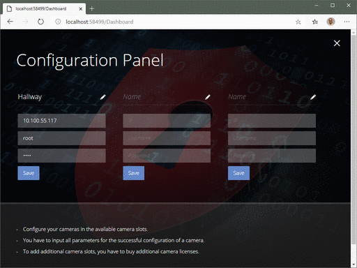

## The sample demonstrates

- How to implement a web application that utilizes the MIP SDK
- How to set up and configure users, roles, and devices, using the
  Configuration API

## Using

- VideoOS.Platform.ConfigurationItems
- ASP.NET Web API 2
- ASP.NET MVC
- 3rd-party NuGet packages

## Requirements

This solution requires the following:

## Environment

- Standalone

## Visual Studio C\# solution

- [SurveillanceCloudSample.sln](javascript:clone('https://github.com/milestonesys/mipsdk-samples-component','SurveillanceCloud/SurveillanceCloudSample.sln');)

## SurveillanceCloudSample solution

The SurveillanceCloudSample solution has three projects:

- SurveillanceCloudSample (ASP.NET MVC web application)

- SurveillanceCloudSampleService (ASP.NET Web API 2 web application)

- SurveillanceCloudSample.SharedObjects (class library)

## SurveillanceCloudSample

The SurveillanceCloudSample project contains the front-end part of the
solution. There are two views: HomeView (login/register page) and
DashboardView (configuration page). Each view has its own model and
controller.

- By default, the HomeView view renders the Login form. If a GET
  request contains the parameter `register`, HomeView renders the
  Register form.

  The Register form requires the user to fill in a username, a
  password, and a valid coupon code. Clicking the Register button
  passes the parameters in a POST request, which calls the Register
  method from HomeController. This method calls the
  SurveillanceCloudSampleService and handles the result. If a new user
  account was successfully created, a corresponding record is created
  in a local JSON data store.

  The Login form requires the user to fill in a username and a
  password. Clicking the Login button passes the parameters in a POST
  request, which calls the Login method from HomeController. This
  method calls the SurveillanceCloudSampleService and handles the
  response. If the login is successful, the method sets the returned
  user ID into the session values for later use.

- After successful login, the DashboardView is called. Before
  rendering the Configuration Panel form, DashboardController calls
  SurveillanceCloudSampleService to get the user's data. DashboardView
  renders the Configuration Panel form depending on how many cameras
  the user is allotted.

  To create a camera device, the user fills in a device IP address,
  username, password, and optionally a device name. When the Save
  button for a device is clicked, the AddDevice method from
  DashboardController is called, passing the form values as POST
  parameters. This method calls the SurveillanceCloudSampleService and
  handles the response.

## SurveillanceCloudSampleService

The SurveillanceCloudSampleService project is the service that
communicates with the Milestone Configuration API.

It uses the Web API 2 Framework. It has only one controller,
ValuesController, which is the default controller. The constructor of
the ValuesController reads the settings needed for connection to the VMS
from the `Web.config` file and then connects to the VMS. The
ValuesController has four methods which can be called by POST request.
The methods are: Register, Login, GetUserCameras and AddDevice.

It also has a private dictionary `codes`, which has all the acceptable
coupon codes hardcoded for registration. The number of camera devices
allotted to the newly created user depends on the code passed to the
Register method. The dictionary looks like this:

~~~cs
private Dictionary<string, int> codes = new Dictionary<string, int> { { "1cam", 1 }, { "2cams", 2 }, { "3cams", 3 }, { "4cams", 4 } };
~~~

Here, if the `1cam` code is entered, the user will be able to add 1
device, if the `2cams` code is entered, the user will be able to add 2
devices, and so forth.

For each new user, a corresponding role is created. This role is
assigned limited rights (live view and playback) to camera devices that
the user adds.

Cameras are added using auto-detection of the camera model; thus, adding
a camera may take a while. The device is added with default properties,
except for the optional name.

If no camera groups exists, a new camera group named SurveillanceCloud
will be created for the first camera added. Else, cameras will be added
to the first camera group created.

## Running the sample using Visual Studio

1. To run the sample, you must first configure the connection to the
   VMS. To do that, open the `Web.config` file located at
   `SurveillanceCloudSampleService\Web.config` and find the
   `VMSSettings` configuration group. It looks like this:

   ~~~xml
   <VMSSettings>
       <Address>
         <add key="SecureOnly" value="true" />
         <add key="Scheme" value="https" />
         <add key="Ip" value="localhost"/>
         <add key="Port" value="443"/>
       </Address>
       <Credentials>
         <add key="Username" value="SurveillanceCloud"/>
         <add key="Password" value="\{R(5[8Hm3+t"/>
         <add key="Authtype" value="Basic"/>
         <!--
           <add key="Authtype" value="Digest"/>
           <add key="Domain" value="."/ 
         -->
       </Credentials>
     </VMSSettings>
   ~~~

   Replace the **SecureOnly**, **Scheme**, **Ip**, **Port**, **Username**, and **Password** fields
   as needed.

   Select **Authtype** \"Digest\" to use Windows authentication. Set
   **Domain** only for **Authtype** \"Digest\".

   The **Username** must exist in the VMS and must have access rights for:

   - Connect to Management Server: Management Server \| Connect

   - Creating roles and basic users: Management Server \| Read, Edit, Manage security

   - Assigning users to a role: Management Server \| Manage security

   - Adding hardware to a Recording Server: Recording Servers \|
     Manage hardware; Hardware \| Edit

   - Adding cameras to a camera group: Cameras \| Read, Edit

2. Open the `SurveillanceCloudSample.sln` solution file with Visual Studio.

3. The project `SurveillanceCloudSampleService` depends on the NuGet package
   `MilestoneSystems.VideoOS.Platform.SDK`.

   To ensure the latest NuGet packages has been downloaded, rebuild the solution.

   `MilestoneSystems.VideoOS.Platform.SDK` includes some unmanaged DLLs
   that are not found by IIS Express or IIS unless you explicitly
   add the `bin` folder of the project `SurveillanceCloudSampleService` to the
   `Path` environment variable:

   1. Open the Start menu and type "Environment variables".
   2. Choose "Edit the system environment variables".
   3. In the System Properties window, select "Environment Variables...".
   4. In the System variables list, select the "Path" variable and add the path of the bin folder.
   5. To ensure the path works, restart Visual Studio.

4. Set the `SurveillanceCloudSample` and
   `SurveillanceCloudSampleService` projects as startup projects. To do
   this, in the **Solution Explorer** window, right click on the
   Solution and select **Set StartUp Projects**.

   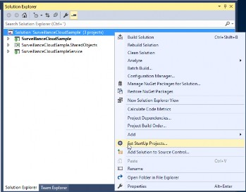

5. Select the **Multiple startup projects** option and set the
   **Action** of `SurveillanceCloudSample` and
   `SurveillanceCloudSampleService` projects to **Start**.

   Then click **OK**.

   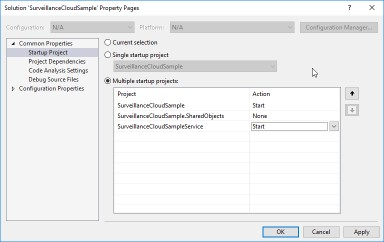

6. Right-click **SurveillanceCloudSampleService** and select **Properties**.

7. In the **SurveillanceCloudSampleService** window, select **Web**. On
   this page, under **Start Action**, select **Don\'t open a page. Wait
   for a request from an external application**.

8. Save.

9. Run the sample using the **Run** button or by pressing F5.

The Login page opens in the web browser.

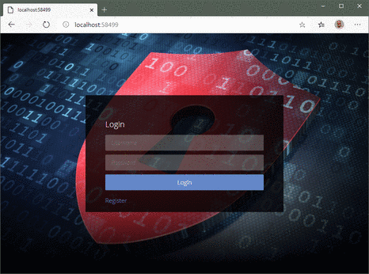

Click the Register button to display the Register form.

See [Registering a new user](#registering_a_new_user) for help on how to
proceed.

## Running the sample using IIS

1. To run the sample without using Visual Studio, you need to enable
   IIS. Open `%windir%\System32\OptionalFeatures.exe`.

2. Select **Internet Information Services** \> **Web Management
   Tools** \> **IIS Management Console** and **World Wide Web
   Services** and click **OK**. Wait for the features to be enabled.

   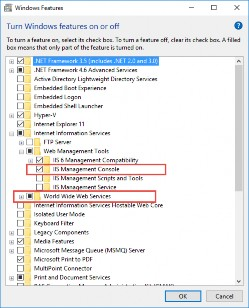

3. Open **Internet Information Services (IIS) Manager**
   (`%windir%\system32\inetsrv\InetMgr.exe`).

4. Right click on **Sites** and select **Add Website...**

   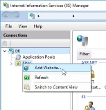

5. In the **Add Website** window, do the following:

   1. In the **Site name** field, enter ***SurveillanceCloudSample***

   2. In the **Port** field, enter ***81***

   3. In the **Physical path** field, enter the path to your
      SurveillanceCloudSample folder

   4. Click **OK**

      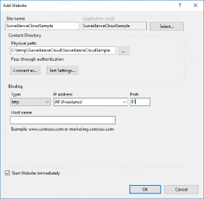

6. In **Application Pools**, select **SurveillanceCloudSample** and
   click **Advanced Settings**.

   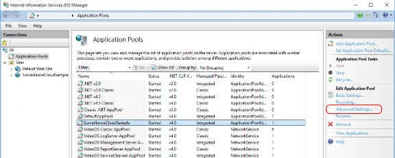

7. In the **Advanced Settings** window, open the **Identity** browser

   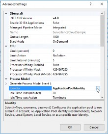

   and select **Network Service** and click **OK**.

   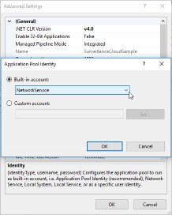

8. In the **Internet Information Services (IIS) Manager**, right click
   on **Sites** and select **Add Website...**

   

9. In the **Add Website** window, do the following:

   1. In the **Site name** field, enter
      `SurveillanceCloudSampleService`

   2. In the **Port** field, enter `8083`

   3. In the **Physical path** field, enter the path to your
      `SurveillanceCloudSampleService` folder

   4. Under the **Application pool** field, click **Select** and
      select **SurveillanceCloudSample** as the application pool

   5. Click **OK**.

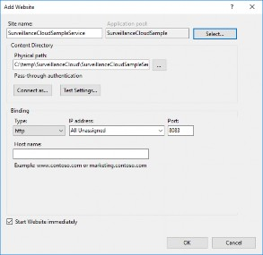

10. The solution depends on the MilestoneSystems.VideoOS.Platform.SDK
    which includes C++ DLLs. Some of these DLLs are not supported by IIS Express or
    IIS. Therefore the bin folder of the SurveillanceCloudSampleService has to be added
    to the path of environment variables. To do so, go to Start menu and type 
    "Environment variables". Choose "Edit Environment variables", in the window
    which opens click on the button named "Environment Variables". In the System Variables
    find the "Path" variable and add the path of the bin folder. In some cases, the IIS will 
    reload the path variables, to be sure the change is used by the IIS, restart the computer.

11. After reboot, Open `http://localhost:81` in your web browser and you are done.

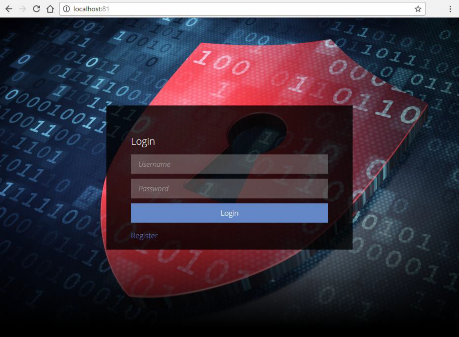

Click the Register button to display the Register form.

See [Registering a new user](#registering_a_new_user) for help on how to
proceed.

## Registering a new user

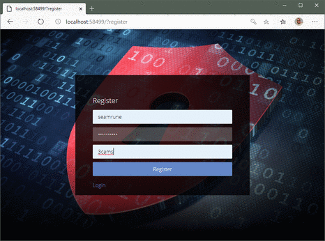

The username must be new: You cannot register an existing user.

The password must meet the complexity requirements for the Windows
operating system on the computer with the Management Server service
installed.

The code must be one of the keys in the `codes` dictionary:

- 1cam
- 2cams
- 3cams
- 4cams

## Adding a camera

After logging in, you can add and manage the number of cameras allowed
by the coupon code.

The camera you add must be new; you cannot add an existing camera.

Enter IP address, username, and password of the new camera in an empty
camera slot. The camera name is optional and can be changed after the
camera has been added. Click the Save button.

Cameras are added using auto-detection of the camera model; thus, adding
a camera may take a while.

## Deleting or replacing a camera

To delete a camera, clear the IP address field and click the Save
button.

To replace a camera, enter IP address, username, and password of the new
camera in an already used camera slot. The camera name is optional and
can be changed after the camera has been added. Click the Save button.

