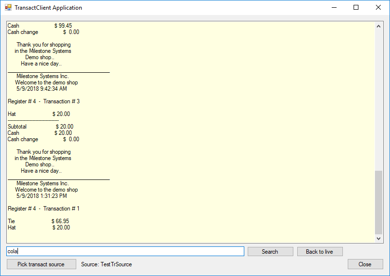

# Transact Client

This sample uses an ItemPickerForm to select the Transact source, and
uses the Transact API for getting and updating the transaction data in
real time.

The TransactClient sample demonstrates:

- How the Transact API can be used to display, search and monitor the
  transactions
- Construction of the TransactQueryClient
- How to use the ItemPickerForm to select the desired Transact source
  from the server
- How to load the desired amount of recorded transaction lines and fetch
  new transaction data in real time using live session control methods
- How to search for transaction text containing a substring using
  `GetExtendedTransactionLinesAsync`

The sample uses the logon dialog to login to an XProtect server, uses
ItemPickerForm to select the Transact source, and uses the Transact API
for getting and updating the transaction data in real time.

After the transaction item is picked, it shows the transactions in live
mode in the text box, it allows searching in the previous transactions,
and then it can return back to live mode.

## Using

- using VideoOS.Platform
- using VideoOS.Platform.Transact.Services.Client
- using VideoOS.Platform.Transact.Services.DataContracts
- using VideoOS.Platform.UI

## Environment

- MIP .NET Library (Component Integration)

## Visual Studio C\# project

- [TransactClient.csproj](javascript:clone('https://github.com/milestonesys/mipsdk-samples-component','src/ComponentSamples.sln');)

## Special notes

Before using the application you should create and set up Transact
source in the Management Client.

This is not intended as a production ready application. Some best
practices, exception handling, and so on might not be used.
