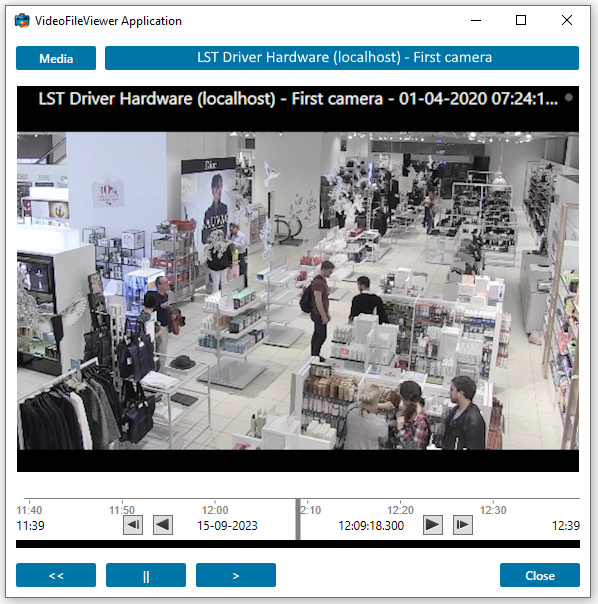

# Video File Viewer

The Video File Viewer sample shows how to use the ImageViewerControl to
view video directly from raw media database files (e.g. BLK files).

The Video File Viewer can display video from these sources:

- XProtect media database storage folders. (NOTE: Never use it with a
  running database - always stop the Recording Server first!)
- Export from the Smart Client in XProtect format.

Choose the folder that contains the `cache.xml` and `archives_cache.xml`
files.

## The sample demonstrates

- Use of the ImageViewerWpfControl and PlaybackWpfUserControl for playback
  of off-line data from XProtect systems

## Using

- VideoOS.Platform.Client.ImageViewerWpfControl
- VideoOS.Platform.Client.PlaybackWpfUserControl

## Environment

- MIP .NET library

## Visual Studio C\# project

- [VideoFileViewer.csproj](javascript:clone('https://github.com/milestonesys/mipsdk-samples-component','src/ComponentSamples.sln');)
