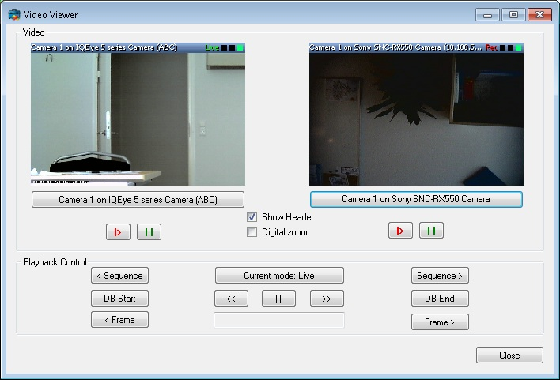

# Video Viewer

The VideoViewer sample can show live and recorded video for two cameras.
After connecting to a server, the user selects two cameras via the
ItemPickerForm.

The two cameras will operate in the same mode and be synchronized with
regards to the playback time and playback commands.

When in playback mode, the *selected* camera will determine the relevant
time for some of the commands, for example the next frame or previous
sequence, and the other camera will follow.

The digital zoom feature can be enabled and disabled by a checkmark.

## The sample demonstrates

-   Connection and login
-   Initialization of MIP .Net Library, when video display is required
-   Video display -- live and playback
-   Digital zoom
-   Use the ItemPickerForm dialog to select cameras
-   Message system to control playback operations

## Using

-   VideoOS.Platform.ClientControl
-   VideoOS.Platform.UI.ItemPickerForm
-   VideoOS.Platform.UI.ImageViewerControl
-   VideoOS.Platform.Messaging

## Environment

-   MIP .NET library

## Visual Studio C\# project

-   [VideoViewer.csproj](javascript:openLink('..\\\\ComponentSamples\\\\VideoViewer\\\\VideoViewer.csproj');)

## Special notes

This sample needs access to configuration and use of ImageViewerControl
for video display.

Use the CopyUIFiles.bat file for copying the correct files from the
MIPSDK folder to your folder, e.g. have this in the post-build event:

~~~ cmd
cd "$(ProjectDir)..\..\bin"
call CopyUIFiles.bat "$(TargetDir)"
~~~

The reason for using this bat file is to allow for updating to new
MIPSDK versions and get any new or changed files included.
