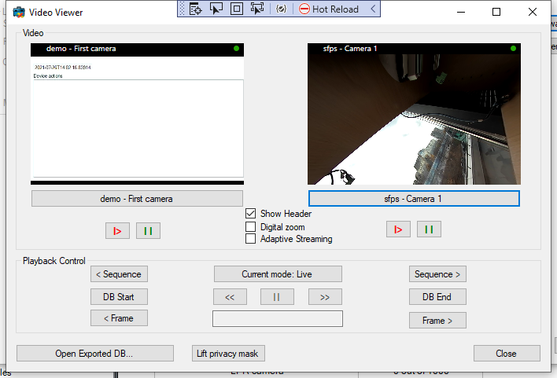

# Video Viewer

The VideoViewer sample can show live and recorded video for two cameras.
After connecting to a server, the user selects two cameras via the
ItemPickerWpfWindow.

The two cameras will operate in the same mode and be synchronized with
regards to the playback time and playback commands.

When in playback mode, the *selected* camera will determine the relevant
time for some of the commands, for example the next frame or previous
sequence, and the other camera will follow.

The digital zoom feature can be enabled and disabled by a checkmark.

The Adaptive Streaming feature can be enabled and disabled by a checkmark, 
if enabled the streaming will be done from the stream that best fits the 
presented size. An appropriate camera setup is required, this means 
configure the test camera with two streams in different resolutions.

The Lift privacy mask button can be used to test liftable masks. An appropriate 
camera setup is required. As a minimum configure one test camera with a liftable mask.

The Open Exported DB button can be used to test the scenario that you
open an exported database instead of being connected to a live system. 
After pressing the button navigate to the folder in the
export that includes the cache.xml/archives_cache.xml files.

## The sample demonstrates

- Connection and login
- Initialization of MIP .NET Library, when video display is required
- Video display -- live and playback
- Digital zoom
- Use the ItemPickerWpfWindow dialog to select cameras
- Message system to control playback operations
- Adaptive streaming
- Opening offline footage

## Using

- VideoOS.Platform.ClientControl
- VideoOS.Platform.UI.ItemPickerWpfWindow
- VideoOS.Platform.Client.ImageViewerWpfControl
- VideoOS.Platform.Messaging

## Environment

- MIP .NET library

## Visual Studio C\# project

- [VideoViewer.csproj](javascript:clone('https://github.com/milestonesys/mipsdk-samples-component','src/ComponentSamples.sln');)
