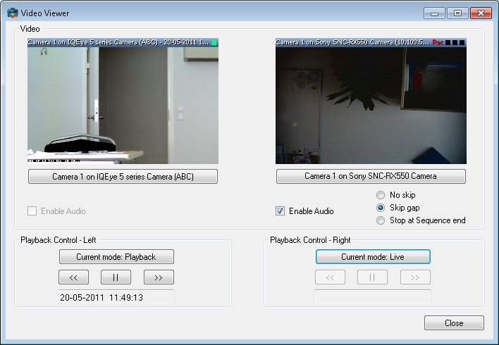

# Video Viewer - Individual Playback

The VideoViewer2Playback sample can show live and recorded video for two
selected cameras. After connecting to a server, you select the two
cameras in the ItemPickerForm.

This sample is similar to the VideoViewer sample, but can control
multiple cameras with respect to mode (live or playback) and time stamp.
It is also possible to select the same camera twice and display both
live and playback video from that camera.

The sample shows one camera for each playback control, but it is
possible to have multiple cameras and audio sources controlled by the
same playback control.

## The sample demonstrates

-   Connection and login
-   Initialization of MIP .Net Library, when video display is required
-   Video display -- live and playback
-   Video display -- individual control of live and playback
-   Digital zoom
-   How to use the ItemPickerForm to select cameras
-   Message system to control playback operations

## Using

-   VideoOS.Platform.ClientControl
-   VideoOS.Platform.UI.ItemPickerForm
-   VideoOS.Platform.UI.ImageViewerControl
-   VideoOS.Platform.Messaging

## Environment

-   MIP .NET library

## Visual Studio C\# project

-   [VideoViewer2playback.csproj](javascript:openLink('..\\\\ComponentSamples\\\\VideoViewer2playback\\\\VideoViewer2playback.csproj');)

## Special notes

This sample needs access to configuration and use of ImageViewerControl
for video display.

Use the CopyUIFiles.bat file for copying the correct files from the
MIPSDK folder to your folder, e.g. have this in the post-build event:

~~~ cmd
cd "$(ProjectDir)..\..\bin"
call CopyUIFiles.bat "$(TargetDir)"
~~~

The reason for using this bat file is to allow for updating to new
MIPSDK versions and get any new or changed files included.
