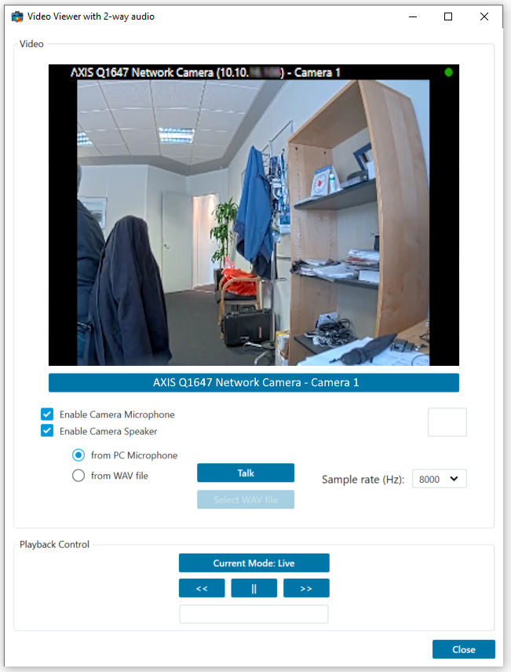

# Video Viewer 2-way Audio

The VideoViewer2WayAudio sample can show live and recorded video from
one camera. After connecting to a server, the user selects what camera
to show via the ItemPickerForm.

If microphone and speakers have been configured and assigned as related
to the camera, two checkmark boxes are enabled. The user can now enable
and disable the use of audio from the camera to the local PCs speakers,
and the user can press the *Talk* button to speak into his microphone
and have the audio transmitted to the speakers attached to the camera.

The audio transmitted to the speaker is always: sampling 8000 times per
second, in mono, and with a bit width of 16 bits per sample.

The driver receiving this format will transcode to the configured audio
codec on the camera.

## The sample demonstrates

-   Connection and login
-   Initialization of MIP .Net Library, when video display is required
-   Video display -- live and playback
-   Listen to audio coming from microphone attached to a camera
-   Speak into a local microphone and transmit to a speaker attached to
    a camera
-   Use the ItemPickerForm dialog to select cameras

## Using

-   VideoOS.Platform.ClientControl
-   VideoOS.Platform.UI.ItemPickerForm
-   VideoOS.Platform.Client.ImageViewerControl
-   VideoOS.Platform.Client.AudioPlayerControl
-   VideoOS.Platform.Data.OutgoingSpeakerController
-   VideoOS.Platform.Messaging

## Environment

-   MIP .NET library

## Visual Studio C\# project

-   [VideoViewer2WayAudio.csproj](javascript:openLink('..\\\\ComponentSamples\\\\VideoViewer2WayAudio\\\\VideoViewer2WayAudio.csproj');)

## Special notes

This sample needs access to configuration, use of ImageViewerControl for
video display and use of AudioPlayerControl for audio playing.
