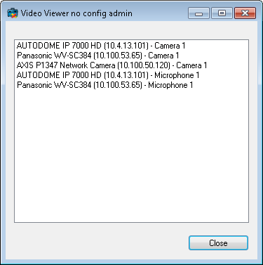

# ImageViewer No Admin

This sample illustrates how to start up and view video very quickly.

The sample includes two projects, one (VideoViewerNoConfigAdmin) to
generate a set of XML\'s defining each camera and microphone relevant
for your application, and one (VideoViewerNoConfig) that uses this
information to quickly start and show video.

During the startup, the MIPSDK only performs a login, but not a
\'GetConfiguration\', and thereby avoid loading the entire
configuration.

This sample simply logs in and stores all relevant configuration for
each camera and microphone in folder C:\\CameraXML\\

This application should be modified to ONLY run when needed.

Demonstrates how to utilize the stored XML to just login and show video,
without loading the entire configuration.

## The sample demonstrates

-   Use of ImageViewerControl

## Using

-   VideoOS.Platform.Client.ImageViewerControl

## Environment

-   .NET library MIP Environment

## Visual Studio C\# project

-   [VideoViewerNoConfig.csproj](javascript:openLink('..\\\\ComponentSamples\\\\VideoViewerNoConfig\\\\VideoViewerNoConfig.csproj');)
-   [VideoViewerNoConfigAdmin.csproj](javascript:openLink('..\\\\ComponentSamples\\\\VideoViewerNoConfigAdmin\\\\VideoViewerNoConfigAdmin.csproj');)
